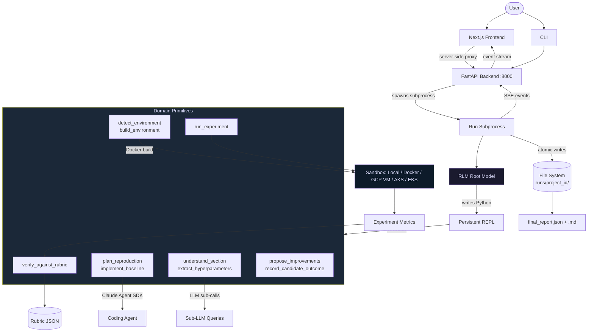

<!-- doc-meta: status=current; last-verified=2026-08-01 -->
# OpenResearch

> **Doc status:** Current · last verified 2026-08-01 against `backend/` + `CLAUDE.md`.
> This README is the public front door (source-of-truth tier 3): it must not claim
> anything the code or [`CLAUDE.md`](CLAUDE.md) don't back. Freshness is
> enforced by `make docs-check` — see [Documentation](#documentation).

> **New to the repository?** Start with [`ONBOARDING.md`](ONBOARDING.md), then
> use the [documentation index](docs/README.md) instead of dated handoffs.

Automated research paper reproduction. Given a paper (arXiv link or PDF), OpenResearch ingests it, builds a compute environment, implements and runs the experiments, scores the reproduction against a rubric, and outputs a benchmark report.

> **Status (2026-07-25):** OpenResearch is the paper-reproduction engine behind
> [deepinvent.ai](https://deepinvent.ai) — DeepInvent (Austin, TX), founded by
> Dr. Marcus Weller. It originated as a hackathon build; the team was
> subsequently hired by DeepInvent to develop it. The code surface in this repo
> remains single-user and locally-run — multi-tenant auth, hosted deployment,
> and a stable public API are **not** built here. End-to-end reproduction works
> on arXiv IDs and PDFs (see [`best_runs/`](best_runs/README.md) for scored
> reproductions). See [Current Limitations](#current-limitations).

Built on the [Recursive Language Model](https://arxiv.org/abs/2512.24601) (RLM) paradigm. The paper is offloaded as a REPL variable; an LLM root model writes Python to orchestrate the reproduction through domain-specific primitives. There is no fixed pipeline -- the model decides what to call and when.

## Feature-ablation scores

Per-feature reproduction scores — each row is the fixed honest baseline plus ONE feature, run
on GCP (L4) with `sonnet-foundry` (real Claude via Foundry API key; **never OAuth**). Full
scoreboard + method: [`docs/2026-08-01-feature-ablation-results.md`](docs/2026-08-01-feature-ablation-results.md).

**Testing sequence:** `baseline` → **Tree-A** (the 7 within-run features below + `all_on`) →
**Tree-B** (scheduler authority: freeze/branch/revive/kill — *gated* on the A1/A2 checkpoint build,
runs via `campaign` not `reproduce`) → **combo of both**. `all_on` here = all 7 Tree-A features,
**not** freezing/Tree-B — see the roadmap in the results doc.

| Feature | Rubric score | Verdict | Δ vs baseline | Date (UTC) |
|---|---:|---|---:|---|
| baseline (no test features) | **0.466** | partial (credited) | — (reference) | 2026-08-03 |
| bes · champion · recipes · expmem · lessons · audit · leafgate | _pending_ | — | _pending_ | — |
| all_on (all features combined) | ❌ failed (0.233, invalid) | failed | n/a — needs re-run | 2026-08-04 |

_Paper: ResNet (1512.03385), seed 1, L4, `sonnet-foundry`._ The **baseline completed end-to-end and
is now credited** (`base_rn3`, 2026-08-03): ~6 h, 2 experiments both `success=True`, **verdict
`partial` (0.466)** — the first run credited instead of clamped to `failed`, validating the
`all_models_failed` guard fix (leaf-status descent) + the venv-PATH launch fix. Shallow nets match
the paper (resnet20-optA ~8.6% vs 8.75%); deep nets under-train (`iters 2000` vs the paper's 64000),
which caps the score below 0.6 — a compute-budget follow-up, not a harness bug. **`all_on_rn5` FAILED
(2026-08-04):** both `run_experiment` calls errored (`cell_execution_error` — buggy agent training
cells), so it produced no result; the 0.233 grades static leaves only and is **not** comparable to
the baseline — this is agent code-bug variance, not a feature effect, and `all_on` needs a clean
re-run. Feature rows populate as arms run; a full per-feature verdict needs ≥3 seeds through the
grader-σ gate — this is the 1-seed screen. Details: [`docs/2026-08-01-feature-ablation-results.md`](docs/2026-08-01-feature-ablation-results.md).

## Architecture



**How the pieces connect:**

- The **frontend** is a pure renderer. It never talks to the backend directly from the browser -- all requests route through Next.js server-side proxy routes (`/api/demo/*`). No CORS layer.
- Each **run** is a long-lived subprocess. The backend HTTP layer is stateless: it spawns processes and reads their output files.
- **Run state is file-backed**, not a service. `runs/<project_id>/` holds the status snapshot, checkpoints, event log, cost ledger, reproduced code, and final report.
- The **SSE event stream** is append-only (`dashboard_events.jsonl`). Clients can reconnect and replay the full history.
- The **paper corpus never reaches the frontend**. A single egress chokepoint (`sse_bridge.sanitize_iteration`) strips REPL locals and bounds output to metadata-only summaries.

## Reproduction Workflow

1. **Ingest** -- Parse the paper (HTML > PDF > OCR cascade via `ResolvingParser`). The winning parse becomes `parsed_full_text.txt`.
2. **Understand** -- The RLM root calls `understand_section` and `extract_hyperparameters` to map the paper's claims, methods, and training recipes.
3. **Environment** -- `detect_environment` reads framework/package clues; `build_environment` creates and repairs a Docker image.
4. **Plan & Implement** -- `plan_reproduction` defines the reproduction contract; `implement_baseline` dispatches a coding agent (Claude Sonnet via `claude-agent-sdk`) to write the code.
5. **Execute** -- `run_experiment` runs the code inside a sandboxed environment (local process or Docker for CPU/dev; a GCP single-VM GPU for remote runs; AKS or EKS for cluster GPU).
6. **Score** -- `verify_against_rubric` grades the reproduction against a PaperBench-style rubric.
7. **Improve** -- `propose_improvements` generates hypotheses; the root evaluates them and iterates. The loop continues until the rubric target is met or budget is exhausted.
8. **Report** -- `final_report.json` and `final_report.md` with verdict, rubric scores, cost breakdown, and model metadata.

## Tech Stack

| Layer | Technology |
|---|---|
| Backend | Python 3.12 (floor 3.11), FastAPI, SQLite (event store) |
| Frontend | Next.js 16, React 19, TypeScript, Tailwind CSS |
| RLM Engine | [`rlms`](https://pypi.org/project/rlms/) library (Algorithm 1 reference implementation) |
| Sub-agents | Claude Agent SDK (Sonnet by default; per-role override via `--models role=token,…`) |
| Root models | GPT-5, Claude (API key), Claude on Azure Foundry, Qwen3-Coder, Azure OpenAI |
| Sandbox | Local / Docker (CPU/dev), GCP single-VM GPU, Azure AKS, AWS EKS |
| PDF Parsing | PyMuPDF, BeautifulSoup (arXiv HTML), Tesseract OCR |
| Evaluation | PaperBench rubric framework |

## Quick Start

### Prerequisites

- Python >= 3.11
- Node.js >= 20.19 (< 21) or >= 22.12
- At least one LLM API key: `OPENAI_API_KEY`, a **funded** `ANTHROPIC_API_KEY`, or Azure
  Foundry (`AZURE_FOUNDRY_*`). ⛔ **Never use OAuth** (`claude login` / `CLAUDE_CODE_OAUTH_TOKEN`
  / `--model claude-oauth`) — operator directive 2026-08-01; see
  `docs/runbooks/2026-08-01-remote-run-llm-auth.md`.
- A Docker daemon (Docker Desktop / OrbStack) — required only for the
  `docker`/`auto` sandboxes (`local` builds no local image; the cloud cell
  images are prebuilt). No Docker yet? `local` works without it —
  `.env.example` ships `OPENRESEARCH_DEFAULT_SANDBOX=local`.

### Setup

```bash
# Backend
python3 -m venv .venv && source .venv/bin/activate
pip install -r backend/requirements.txt
pip install -r backend/requirements-dev.txt  # pytest + parallel runners

# Frontend
cd frontend && npm ci && cd ..

# Environment
cp .env.example .env
# Edit .env: set at least one API key. The example pins
# OPENRESEARCH_DEFAULT_SANDBOX=local (no Docker needed); switch to
# docker once a daemon is in place, or a cloud sandbox once its
# credentials + preflight are green.
```

### Run

**One command starts the full stack** — backend (`:8000`) + frontend (`:3000`)
together — with sandbox preflight (Docker for local, or the selected cloud) and
automatic Node selection via `nvm` (the system Node is often outside Next's
supported range):

```bash
./start.sh
# → backend  http://127.0.0.1:8000
# → frontend http://localhost:3000   ← open this
```

For remote GPU work on **GCP**, the supported path is a single VM: provision a
fresh GPU VM, run `reproduce --sandbox local` on it, and auto-delete when done —
the validated end-to-end procedure is
[`docs/runbooks/2026-07-22-gcp-vm-e2e-run-procedure.md`](docs/runbooks/2026-07-22-gcp-vm-e2e-run-procedure.md).
GKE is **not used** — a fail-closed guard rejects `--sandbox gcp/gke` on the
reproduction path (`OPENRESEARCH_ALLOW_GKE` is an inert operator-only escape
hatch, not a supported path); the single-VM path above is the GCP GPU route. The optional `aws` sandbox is an EKS+S3/IRSA
cell-matrix adapter (never a generic remote shell): configure its pinned image,
one-GPU node pool, explicit verified rate, and IRSA first, then run `python -m
backend.cli aws-preflight --project-id <project> --run-id <probe>` before a billed
run. `azure` runs on AKS. See [`docs/operations.md`](docs/operations.md).

`OPENRESEARCH_DEFAULT_SANDBOX` (shell env > `.env` > `local`) selects the sandbox and
which preflight runs. Escape hatches: `START_BACKEND_ONLY=1`, `START_FRONTEND_ONLY=1`,
`START_SKIP_PREFLIGHT=1`. `Ctrl-C` tears down both processes.

Or run the two processes by hand:

```bash
# Terminal 1: backend
.venv/bin/uvicorn backend.app:create_app --factory --reload --port 8000

# Terminal 2: frontend  (Node 20.19–<21 or ≥22.12; `nvm use 20` if the system Node is out of range)
cd frontend
export OPENRESEARCH_BACKEND_URL=http://127.0.0.1:8000
npm run dev
# Open http://localhost:3000
```

### CLI

```bash
python -m backend.cli reproduce paper.pdf --sandbox docker
python -m backend.cli reproduce 2605.15155 --sandbox local  # incl. a GCP GPU VM
python -m backend.cli ingest 2512.24601  # ingest only
```

**Flags:** `--mode {rlm,rdr,rlm-pure}`, `--provider {anthropic,openai}`, `--sandbox {auto,local,docker,azure,aws,gcp}`, `--model {gpt-5,claude,sonnet-foundry,opus-foundry,qwen3-coder,azure}`, `--max-usd`, `--max-wall-clock`, `--vram-gb` (`claude-oauth` exists in code but is ⛔ forbidden — never use it)

### Docker

```bash
cp .env.example .env  # set API keys
docker compose up --build
```

## Environment Variables

| Variable | Required | Description |
|---|---|---|
| `OPENAI_API_KEY` | One auth path | Root model when `--model gpt-5` (the default root). |
| `ANTHROPIC_API_KEY` | One auth path | Sub-agents (Sonnet) and `--model claude`. Must be a **funded** key — a no-credit key hard-fails with no fallback. ⛔ OAuth is forbidden (directive 2026-08-01); the sanctioned alternative surface is Azure Foundry (`sonnet-foundry`). See `CLAUDE.md` → "RLM auth". |
| `OPENRESEARCH_DEFAULT_SANDBOX` | No | `auto` / `local` / `docker` / `azure` / `aws` / `gcp` (default `local`) |
| `OPENRESEARCH_AZURE_*` | For Azure | AKS GPU sandbox (cluster, storage, base image) |
| `OPENRESEARCH_AWS_*` | For AWS | EKS GPU sandbox (cluster, S3 bucket, pinned image, IRSA) |
| `OPENRESEARCH_GCP_*` | For GCP | GCP config (single-VM GPU path is the supported route; GKE not used) |
| `OPENRESEARCH_DEMO_SECRET` | No | Gate run-start endpoints with a shared secret |
| `OPENRESEARCH_DYNAMIC_GPU` | No | `true` (default): auto-select GPU SKU per paper |
| `OPENRESEARCH_MAX_RUN_GPU_USD` | No | Per-run GPU spend cap (float, default 10.0) |

See `.env.example` for the full list.

> **Env-var rename (2026-06):** the prefix was renamed `REPROLAB_` → `OPENRESEARCH_`.
> A backward-compat shim (`backend/config.py::_apply_legacy_env_aliases`) still reads
> the old `REPROLAB_*` names, so existing deployments and shells keep working
> unchanged; new setups should use `OPENRESEARCH_*`. The SQLite default likewise
> moved `reprolab.db` → `openresearch.db` but falls back to an existing `reprolab.db`.
> One exception with no auto-fallback: if you use the Codex sub-agent and have a
> `reprolab-readwrite` profile in `~/.codex/`, rename it to `openresearch-readwrite`
> or set `OPENRESEARCH_CODEX_PROFILE=reprolab-readwrite`.

## UI Pages

| Route | Description |
|---|---|
| `/` | Landing page |
| `/lab` | Live run viewer -- exploration tree, rubric climb, primitive history, steering chat |
| `/lab?projectId=<id>` | View a specific run |
| `/leaderboard` | Ranked completed runs across models and papers |
| `/library` | Browse all runs |

## Testing

```bash
# Backend tests
.venv/bin/python -m pytest tests/ -n auto       # all (~560 files / ~7,200 tests, ~2.5 min parallel)
.venv/bin/python -m pytest tests/rlm/            # RLM tests only

# Frontend
cd frontend
npx tsc --noEmit      # type check
npm test              # vitest run (non-watch)
npm run lint          # eslint

# E2E
cd frontend && npx playwright install chromium   # one-time browser download
cd frontend && npx playwright test               # needs the backend on :8000
```

## Project Structure

```
backend/
  agents/
    rlm/              # RLM orchestrator: primitives, binding, system prompt, SSE bridge
    rdr/              # Rubric-driven harness (--mode rdr)
    runtime/          # LLM runtime resolution (Claude, OpenAI, Azure)
    resilience/       # Budget, cost tracking, failure classification
  services/
    ingestion/        # Paper parsing: PDF, HTML, OCR, arXiv fetcher
    runtime/          # Sandbox backends: local, Docker, GCP VM, AKS, EKS, GPU catalog
    events/           # SSE event stream, run lifecycle
  evals/              # PaperBench scoring, leaf scorer, A/B testing
  routes/             # HTTP routes: leaderboard, messages, reports
  app.py              # FastAPI application factory
  cli.py              # CLI entry point
  config.py           # Settings (pydantic-settings)

frontend/
  src/
    app/              # Next.js pages: lab, leaderboard, library, landing
    components/
      lab/rlm/        # Lab UI: exploration canvas, rubric strip, steering chat, sidebar
      landing/        # Landing page
      library/        # Run browser
    hooks/            # React hooks: useRlmRun, useSteeringChat, useRdrArtifacts
    lib/              # Shared utilities, event types, auth

tests/                # ~3,600 backend tests (pytest)
scripts/              # Dev tools: cloud preflight, PaperBench runners, monitoring
third_party/          # Vendored PaperBench bundles (rubrics + paper markdown)
docs/                 # Small current-doc set and generated references
```

## Execution Modes

| Mode | Flag | Description |
|---|---|---|
| **RLM (hybrid)** | `--mode rlm` (default) | RDR Phase 1 (rubric decomposition without repair) + RLM adaptive repair on weak clusters |
| **RDR** | `--mode rdr` | Pure rubric-driven controller. Decomposes rubric into work-clusters, dispatches one coding agent per cluster, repairs weak clusters in a capped loop. No LLM in the control flow. |
| **RLM-pure** | `--mode rlm-pure` | Direct RLM root loop without the hybrid RDR phase. The pre-hybrid path. |

## Dynamic GPU Selection

When `OPENRESEARCH_DYNAMIC_GPU=true` (default), the root model estimates VRAM requirements from the paper and the system selects the cheapest matching GPU SKU from a static catalog (8 GPUs, RTX 4090 through H200). On CUDA OOM, the system auto-escalates to the next tier (up to 2 escalations). Override with `--vram-gb <n>`.

## LLM Auth Model

Two independent auth surfaces:

1. **Root model** (RLM library) -- raw HTTP. Pick one: `--model gpt-5` (OpenAI), `--model claude` (funded Anthropic API key), `--model sonnet-foundry` / `--model opus-foundry` (Anthropic on Azure Foundry), `--model azure` (Azure OpenAI).
2. **Sub-agents** (Claude Sonnet via `claude-agent-sdk`) -- a funded `ANTHROPIC_API_KEY` or the Foundry surface. ⛔ **Never OAuth** (operator directive 2026-08-01): no `--model claude-oauth`, no `CLAUDE_CODE_OAUTH_TOKEN`, no `claude login` — root or sub-agents, local or remote.

For local development: OpenAI root (~$1/run) + a funded/Foundry key for sub-agents. Full auth matrix: `docs/runbooks/2026-08-01-remote-run-llm-auth.md`.

## Current Limitations

- Single-user local deployment (this repo's code surface). No multi-tenant auth or distributed state.
- Cost ledger is blind to Foundry-routed LLM spend and idle GPU-node time — a `$0` there is not proof of $0; verify via `tokens_total.json`.
- GPU execution needs a cloud account: a GCP GPU VM (single-VM path), or AKS/EKS with its preflight green.
- Frontend engines: Node >=20.19 <21 or >=22.12 (enforced via package.json `engines`).

## Documentation

| Document | Purpose |
|---|---|
| [ONBOARDING.md](ONBOARDING.md) | First day: setup, commands, and project boundaries |
| [CLAUDE.md](CLAUDE.md) | Developer conventions and constraints |
| [docs/architecture.md](docs/architecture.md) | Current backend/frontend/RLM topology |
| [docs/engineering-guide.md](docs/engineering-guide.md) | Durable engineering decisions and constraints |
| [docs/operations.md](docs/operations.md) | Setup, checks, and safe run operation |
| [docs/policies/artifacts.md](docs/policies/artifacts.md) | What belongs in Git |

### Source of truth

Authority runs **code → architecture → `CLAUDE.md` → `README.md`**. When prose
disagrees with the code, code wins.

### Generated artifacts

These are **outputs of runs**, not hand-written docs. They reflect the run that
produced them and are not regenerated by a docs command (regenerating means
re-running an expensive reproduction):

| Artifact | What it is |
|---|---|
| [`best_runs/`](best_runs/README.md) | Point-in-time scored reproductions (Adam, All-CNN, VAE + the SDAR campaign) with full sidecars |
| `runs/<project_id>/` | Live per-run state: `final_report.{json,md}`, event log, cost ledger, reproduced `code/` (gitignored) |
| `best_runs/<id>/` | A curated committed reference run |

Tracked PDFs (`paperbench1.pdf`, `demo_paper.pdf`) are **input fixtures** — the
papers being reproduced. Papers don't go stale; they are not generated output.

### Documentation freshness

Current-state docs carry a machine-readable marker
(`<!-- doc-meta: status=current; last-verified=YYYY-MM-DD -->`). A checker enforces
it — run before pushing docs changes, and in CI on every PR:

```bash
make docs-check                      # or: python scripts/docs_freshness_check.py
```

It fails on tracked PDFs in the wrong place, current-state docs missing a freshness
marker, broken internal links, README references to missing files, or a working-note
file reappearing at the repo root. See the policy doc for the rules.
