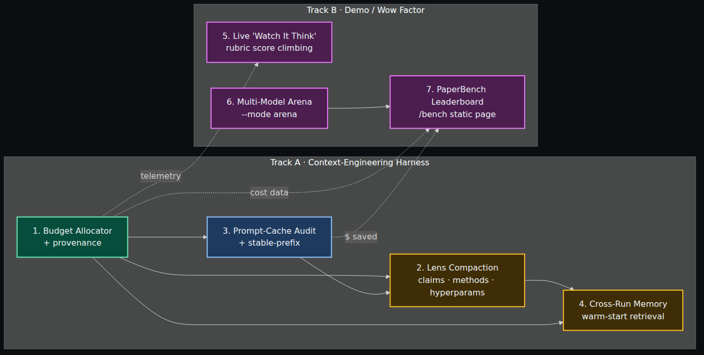
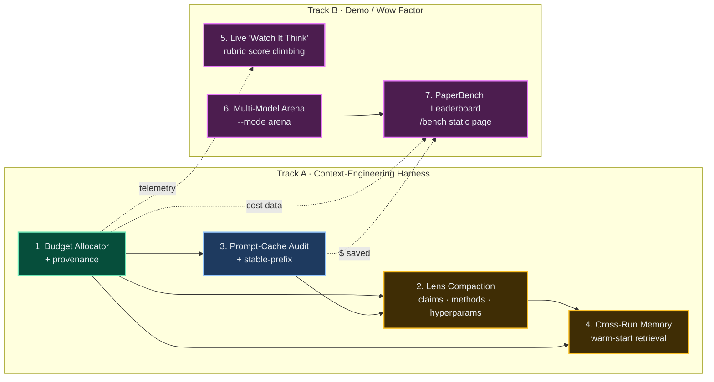
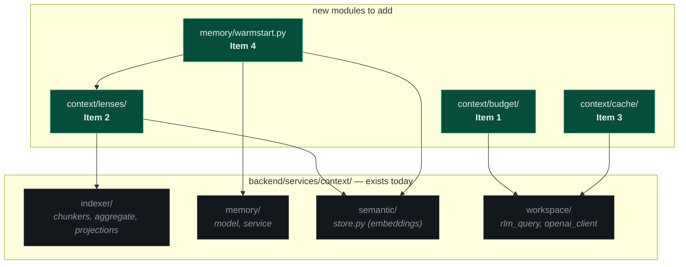
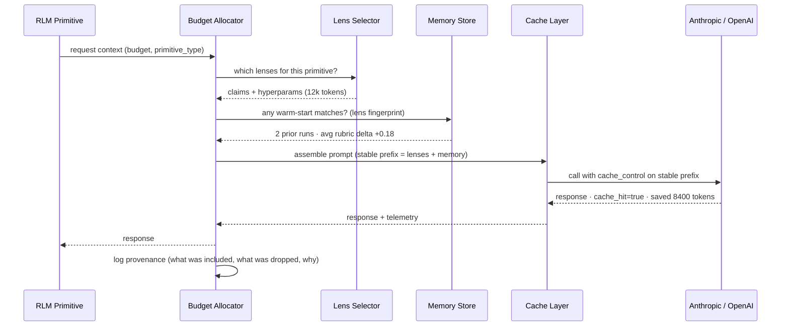
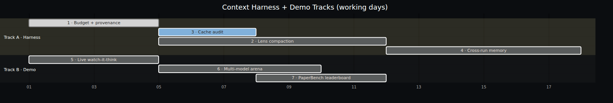
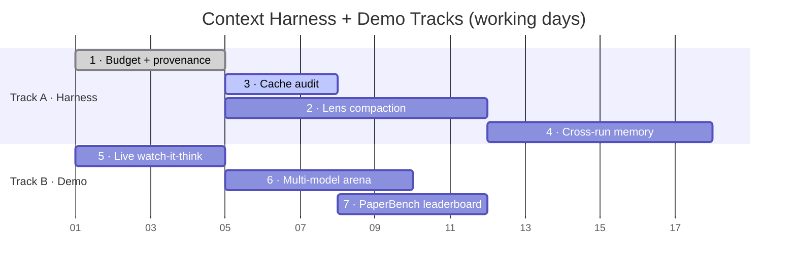

# Context-Engineering Harness + Demo Track — Build Plan

**Status:** Proposal for team approval
**Owner:** TBD
**Target branch:** `claude/great-tesla-xor5z` (will fan out into sub-PRs per item)
**Window:** ~3 weeks for Track A, ~2 weeks for Track B in parallel

---

## TL;DR

Two parallel tracks:

- **Track A — Harness (Items 1–4):** turn the RLM from "stuff the prompt and hope"
  into a measured, cached, lens-driven, memory-augmented system. Order **1 → 3 → 2 → 4**
  because each item's *measurements* unlock the next item's *design decisions*.
- **Track B — Demo / Wow (Items 5–7):** make the system *visible* for the
  Microsoft VP review. Live rubric demo, multi-model arena, public leaderboard.
  Plumbs into Track A's telemetry but doesn't block on it.

| # | Track | Piece | Why this slot |
|---|---|---|---|
| **1** | A | Token-budget allocator + provenance | Foundation — everything else needs "how many tokens, from where, why?" |
| **3** | A | Prompt-caching audit | Cheap, immediate $ savings. Forces the stable-prefix discipline #2 relies on. |
| **2** | A | Lens-specific semantic compaction | Now we know per-primitive needs (#1) and stable-prefix shape (#3). |
| **4** | A | Cross-run memory | Built on lens fingerprints (#2) and provenance (#1). Compounds everything else. |
| **5** | B | Live "watch it think" demo | Highest-ROI VP moment. Score climbing on screen during the self-improvement loop. |
| **6** | B | Multi-model arena (`--mode arena`) | GPT-5 / Qwen3-Coder / Kimi K2.5 / Claude on the same paper, parallel. Model-agnostic story. |
| **7** | B | Public PaperBench leaderboard | Static `/bench` page — papers × models × score × $ × wall-clock. Benchmark-defining framing. |

---

## Build-order DAG (both tracks)

---

## Where each piece lives

The repo already has the right scaffolding under `backend/services/context/`:

---

## Runtime data flow (after all four ship)

---

## Item 1 — Token-budget allocator + provenance

**Goal.** Every primitive call declares a budget; the allocator decides what
content fits, logs what made it in / what got dropped, and emits per-call
telemetry. No more invisible token spend.

**Scope.**
- New module: `backend/services/context/budget/`
  - `allocator.py` — `ContextBudget(primitive, max_tokens)`; `.include(chunk, reason)`; `.finalize() -> AssembledContext`
  - `provenance.py` — structured log entry per call: `{primitive, allotted, used, included: [{source, hash, tokens, reason}], dropped: [...]}`
- Wire into `backend/services/context/workspace/tools/rlm_query.py` (the RLM call site) and the OpenAI/Anthropic client wrappers.
- Emit to existing `*.jsonl` event log + aggregate into `final_report.json` as `context_telemetry`.
- CLI: add `--show-context-budget` to print per-stage table at end of run.

**Files touched.** ~6 new (`budget/*`), ~3 modified (`rlm_query.py`, `openai_client.py`, `final_report` writer).

**Exit criteria.**
- Every LLM call in `--mode rlm` produces a provenance record.
- `final_report.json` includes `context_telemetry` with per-primitive token totals.
- Unit tests for budget over/underflow, drop-priority ordering, and provenance serialization.

**Risk.** Low. Pure observability; no behavioral change to existing prompts.

**Estimate.** 3–4 days.

---

## Item 3 — Prompt-caching audit + stable-prefix enforcer

**Goal.** Make Anthropic & OpenAI prompt caches actually fire. Measure $ saved.

**Scope.**
- New module: `backend/services/context/cache/`
  - `prefix.py` — `StablePrefix` builder enforcing: `system → paper context → fixed instructions → variable context`. Refuses to assemble if the cache-eligible portion shifts between calls.
  - `telemetry.py` — parses provider responses for `cache_creation_input_tokens` / `cache_read_input_tokens`; computes hit rate and $ saved using current model pricing table.
- Add `cache_control: {type: "ephemeral"}` markers on the stable prefix in Anthropic calls; equivalent for OpenAI Responses API.
- Surface in `final_report.json` as `cache_summary: {hit_rate, tokens_saved, usd_saved}`.

**Files touched.** ~4 new, ~2 modified (the LLM client wrappers).

**Exit criteria.**
- A repeated run on the same paper shows ≥50% cache hit rate by call #3.
- `usd_saved` appears in the run report and matches the provider invoice within 5%.
- Regression test: assembling a prompt with a non-stable prefix raises.

**Risk.** Low–medium. Requires careful ordering; can break a primitive's prompt if not careful — gated behind a feature flag `REPROLAB_CACHE_ENFORCE` during rollout.

**Estimate.** 2–3 days.

---

## Item 2 — Lens-specific semantic compaction

**Goal.** Stop sending the whole paper to every agent. Pre-compute 4–5 named
"lenses" of `parsed_full_text.txt`; each primitive declares which lenses it needs.

**Scope.**
- New module: `backend/services/context/lenses/`
  - `lens_spec.py` — `Lens` dataclass: `name`, `purpose`, `extractor_prompt`, `max_tokens`
  - `lenses.py` — defaults: `claims`, `methods`, `hyperparams`, `ablations`, `datasets`
  - `compactor.py` — generates lenses once per paper, caches under `runs/<project_id>/lenses/<lens>.md`
- Each primitive in `backend/agents/rlm/` declares `LENSES = [...]` class-attr; budget allocator (Item 1) pulls them in priority order.
- Lens cache files become a stable prefix for Item 3's cache layer → compounding savings.

**Files touched.** ~7 new, ~4 modified (each RLM primitive declares its lenses).

**Exit criteria.**
- Average primitive input tokens drop ≥40% vs baseline on a 3-paper sample.
- Rubric score stays within ±2% of baseline (we're not losing accuracy).
- Lens files are reproducible by `paper_hash + lens_name` (deterministic).

**Risk.** Medium. Wrong lens content can degrade primitive quality. Mitigated by:
- Side-by-side eval mode (`--lens-mode {off, on, compare}`)
- The rubric verifier already in the pipeline catches regressions at Gates 2/3

**Estimate.** 5–7 days (the lens extractors themselves are the long pole).

---

## Item 4 — Cross-run memory (warm-start retrieval)

**Goal.** Compound learning across reproductions. When a new run starts, retrieve
top-k similar prior primitive invocations and their outcomes; surface as
"this dataset loader pattern matched repro #14 — here's what worked."

**Scope.**
- Extend `backend/services/context/memory/`:
  - `warmstart.py` — `MemoryStore.search(primitive_type, lens_fingerprint, k=3)` over the existing `semantic/store.py` embedding index
  - `record.py` — on primitive completion: persist `{primitive, lens_fingerprint, input_hash, output, rubric_delta}` keyed by paper_hash
- New primitive wrapper: prepend top-k retrieved records as a `prior_attempts` block in the budget allocator (Item 1 handles inclusion).
- Surface in run report: `warm_starts: [{primitive, source_run, similarity, rubric_delta_at_source}]`.

**Files touched.** ~5 new, ~2 modified.

**Exit criteria.**
- After 10 historical runs in the store, an 11th run on a similar paper shows ≥1 warm-start hit per primitive on average.
- A/B comparison (`--memory {off, on}`) shows rubric-score lift ≥0.05 on average across 3 paired runs.
- Retrieval latency <200ms per primitive (SQLite + local embeddings).

**Risk.** Medium. Two failure modes:
1. Bad retrieval poisons new runs → mitigated by retrieving only records with positive `rubric_delta`.
2. Cold start — needs a corpus of past runs. We have ~5 historical runs already; bootstrap with synthetic warm-starts from PaperBench bundles.

**Estimate.** 5–6 days.

---

## Track B — Demo / Wow Factor

These three are the VP-facing pieces. Each is independently shippable; together
they're the 90-second screen recording that sells the project before anyone
reads the code.

### Item 5 — Live "watch it think" demo

**Goal.** Side-by-side panel showing the rubric score climbing in real time as
the self-improvement loop runs. Nothing sells an agent like watching a number
go from 0.34 → 0.71 on screen.

**Scope.**
- New UI pane in `frontend/src/components/lab/` — `RubricTimeline.tsx`
- Subscribe to the existing SSE stream (`/runs/<id>/events`); add a `rubric_update` frame from `backend/agents/rubric_verifier/` whenever Gate 2 / Gate 3 / improvement-iteration scores it
- Plot: line chart of rubric score over time, milestone pins for Gate events, hover tooltip with which subscores moved
- Re-uses Item 1's provenance log to surface "what context change drove this delta?" on hover

**Files touched.** ~2 new (UI + a small SSE frame type), ~2 modified (verifier emits the event).

**Exit criteria.** Live demo: start a run, watch the score climb through ≥2 improvement iterations without page refresh. Tooltip names the contributing primitives.

**Risk.** Low. Pure read-side; existing SSE infra.

**Estimate.** 3–4 days.

---

### Item 6 — Multi-model arena (`--mode arena`)

**Goal.** Run GPT-5, Qwen3-Coder, Kimi K2.5, and Claude on the same paper in
parallel; show a leaderboard pane comparing rubric score, $ spent, and
wall-clock per model. Positions the repo as **model-agnostic infrastructure** —
which is exactly the framing Microsoft wants (they're not locked to one vendor
either).

**Scope.**
- New mode in `backend/cli.py`: `--mode arena --models gpt-5,qwen3-coder,kimi-k2.5,claude`
- New orchestrator entry in `backend/agents/arena/` that spawns N parallel RLM subprocesses (one per model), each writing to `runs/<project_id>/arena/<model>/`
- Aggregator: when all complete, write `arena_report.json` with per-model rubric/$/time
- UI: `frontend/src/app/lab/arena/page.tsx` — leaderboard view with a "play" button that re-runs
- Cost guardrail: `--max-usd-per-model` and a hard ceiling on parallel pods (RunPod sandbox)

**Files touched.** ~6 new, ~2 modified (CLI + run-status writer).

**Exit criteria.**
- Single CLI command kicks off 4 parallel runs on one paper.
- Arena page shows final leaderboard with model · score · $ · time within a single screenshot.
- Failure isolation: one model crashing doesn't bring down the others.

**Risk.** Medium. Cost can spike if guardrails miss; concurrency on RunPod needs throttling. Mitigated by `--max-usd-per-model` (hard fail) + a `--dry-run` mode that estimates cost first.

**Estimate.** 5 days.

---

### Item 7 — Public PaperBench leaderboard (`/bench`)

**Goal.** Static page that turns every `final_report.json` we've ever emitted
into a public leaderboard: papers × models × rubric score × $ × wall-clock.
Frames the project as **benchmark-defining**, not just another agent.

**Scope.**
- New aggregator: `backend/services/scoring/leaderboard.py` — walks all `runs/*/final_report.json`, produces a single `leaderboard.json`
- New static page: `frontend/src/app/bench/page.tsx` — sortable table, filter by paper / model / sandbox, sparkline of score-over-time per paper
- Cost & cache columns sourced from Item 1's `context_telemetry` and Item 3's `cache_summary`
- Auto-publish: GitHub Action regenerates `leaderboard.json` on every merge to main; the `/bench` page is statically built

**Files touched.** ~3 new (aggregator + page + workflow), ~1 modified (Next.js routes).

**Exit criteria.**
- `/bench` loads in <500ms with ≥5 papers' worth of data.
- Sortable on every column; deep-linkable filters (`/bench?paper=2512.24601`).
- Auto-refreshes when a new run lands on main.

**Risk.** Low. Pure presentation layer over data we already emit.

**Estimate.** 3–4 days.

---

## Timeline (both tracks)

Realistic ship window: **Track A ~3 weeks**, **Track B ~2 weeks in parallel**.
Demo (#5) can start day-1 because it only needs the existing SSE infra; it gets
*richer* once Item 1's provenance lands. Leaderboard (#7) gates on Item 3
because that's where the `$` and cache columns come from.

---

## Metrics we'll report at the end

| Metric | Source | Target |
|---|---|---|
| Avg input tokens per primitive | Item 1 telemetry | −40% vs baseline |
| Cache hit rate (steady state) | Item 3 telemetry | ≥60% |
| $ per paper (RLM mode) | Items 1+3 | −50% |
| Warm-start hits per run | Item 4 | ≥1 per primitive after 10-run corpus |
| Rubric score delta | rubric verifier | ≥0, ideally +0.05 |
| Time-to-first-rubric-tick | Item 5 | <30s from run start (demo-ready) |
| Models in arena | Item 6 | 4 (GPT-5, Qwen3-Coder, Kimi K2.5, Claude) |
| Papers on `/bench` at demo | Item 7 | ≥10 |

These are the numbers we put on the slide for the Microsoft VP review.

---

## Open questions for the team

1. **Lens defaults** — are `claims / methods / hyperparams / ablations / datasets` the right starting set, or do we want a sixth (`related_work`, `limitations`)?
2. **Cache backend for warm-starts** — stick with `semantic/store.py` (already exists) or pull in a heavier dep like `lancedb`/`chromadb`?
3. **Feature-flagging strategy** — one master flag (`REPROLAB_CTX_HARNESS_V2`) or per-item flags so we can A/B each piece independently? (I lean per-item.)
4. **Eval cadence** — how often do we re-run the 3-paper baseline to catch regressions? Per-PR is expensive; nightly is probably the right call.
5. **Who owns each item?** — Items 1 and 3 are tight and well-scoped; Items 2 and 4 benefit from a second pair of eyes on the lens prompts and the retrieval-poisoning failure mode.

---

## Approval ask

If the team is +1 on the **order, scope, and metrics** above, I'll:
1. Open a tracking issue with this doc linked.
2. Cut four sub-PRs off `claude/great-tesla-xor5z`, one per item, each gated on the prior item's exit criteria.
3. Wire the telemetry into `final_report.json` so we can show the numbers climb in real time during the VP demo.
