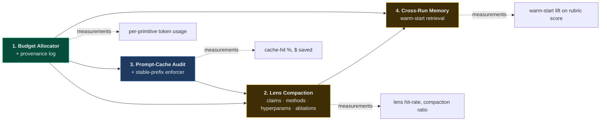
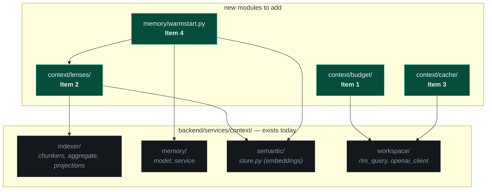
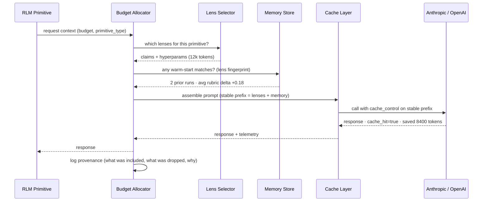

# Context-Engineering Harness — Build Plan

**Status:** Proposal for team approval
**Owner:** TBD
**Target branch:** `claude/great-tesla-xor5z` (will fan out into sub-PRs per item)
**Window:** ~3 weeks of focused work, can run partially in parallel after Item 1 lands

---

## TL;DR

Ship four pieces that turn the RLM harness from "stuff the prompt and hope" into
a measured, cached, lens-driven, memory-augmented system. Build order is
**1 → 3 → 2 → 4** because each item's *measurements* unlock the next item's
*design decisions* — no guessing budgets, lens sizes, or cache strategies.

| # | Piece | Why this slot |
|---|---|---|
| **1** | Token-budget allocator + provenance | Foundation. Everything else needs "how many tokens did this primitive *actually* use, and where did they come from?" |
| **3** | Prompt-caching audit | Cheap, immediate $ savings. Forces the stable-prefix discipline that #2 will rely on. |
| **2** | Lens-specific semantic compaction | Now we know per-primitive needs (from #1) and stable-prefix shape (from #3). Lenses become the cached prefix. |
| **4** | Cross-run memory | Built on lens fingerprints from #2 and the provenance log from #1. Last because it compounds the value of everything below it. |

---

## Build-order DAG

---

## Where each piece lives

The repo already has the right scaffolding under `backend/services/context/`:

---

## Runtime data flow (after all four ship)

---

## Item 1 — Token-budget allocator + provenance

**Goal.** Every primitive call declares a budget; the allocator decides what
content fits, logs what made it in / what got dropped, and emits per-call
telemetry. No more invisible token spend.

**Scope.**
- New module: `backend/services/context/budget/`
  - `allocator.py` — `ContextBudget(primitive, max_tokens)`; `.include(chunk, reason)`; `.finalize() -> AssembledContext`
  - `provenance.py` — structured log entry per call: `{primitive, allotted, used, included: [{source, hash, tokens, reason}], dropped: [...]}`
- Wire into `backend/services/context/workspace/tools/rlm_query.py` (the RLM call site) and the OpenAI/Anthropic client wrappers.
- Emit to existing `*.jsonl` event log + aggregate into `final_report.json` as `context_telemetry`.
- CLI: add `--show-context-budget` to print per-stage table at end of run.

**Files touched.** ~6 new (`budget/*`), ~3 modified (`rlm_query.py`, `openai_client.py`, `final_report` writer).

**Exit criteria.**
- Every LLM call in `--mode rlm` produces a provenance record.
- `final_report.json` includes `context_telemetry` with per-primitive token totals.
- Unit tests for budget over/underflow, drop-priority ordering, and provenance serialization.

**Risk.** Low. Pure observability; no behavioral change to existing prompts.

**Estimate.** 3–4 days.

---

## Item 3 — Prompt-caching audit + stable-prefix enforcer

**Goal.** Make Anthropic & OpenAI prompt caches actually fire. Measure $ saved.

**Scope.**
- New module: `backend/services/context/cache/`
  - `prefix.py` — `StablePrefix` builder enforcing: `system → paper context → fixed instructions → variable context`. Refuses to assemble if the cache-eligible portion shifts between calls.
  - `telemetry.py` — parses provider responses for `cache_creation_input_tokens` / `cache_read_input_tokens`; computes hit rate and $ saved using current model pricing table.
- Add `cache_control: {type: "ephemeral"}` markers on the stable prefix in Anthropic calls; equivalent for OpenAI Responses API.
- Surface in `final_report.json` as `cache_summary: {hit_rate, tokens_saved, usd_saved}`.

**Files touched.** ~4 new, ~2 modified (the LLM client wrappers).

**Exit criteria.**
- A repeated run on the same paper shows ≥50% cache hit rate by call #3.
- `usd_saved` appears in the run report and matches the provider invoice within 5%.
- Regression test: assembling a prompt with a non-stable prefix raises.

**Risk.** Low–medium. Requires careful ordering; can break a primitive's prompt if not careful — gated behind a feature flag `REPROLAB_CACHE_ENFORCE` during rollout.

**Estimate.** 2–3 days.

---

## Item 2 — Lens-specific semantic compaction

**Goal.** Stop sending the whole paper to every agent. Pre-compute 4–5 named
"lenses" of `parsed_full_text.txt`; each primitive declares which lenses it needs.

**Scope.**
- New module: `backend/services/context/lenses/`
  - `lens_spec.py` — `Lens` dataclass: `name`, `purpose`, `extractor_prompt`, `max_tokens`
  - `lenses.py` — defaults: `claims`, `methods`, `hyperparams`, `ablations`, `datasets`
  - `compactor.py` — generates lenses once per paper, caches under `runs/<project_id>/lenses/<lens>.md`
- Each primitive in `backend/agents/rlm/` declares `LENSES = [...]` class-attr; budget allocator (Item 1) pulls them in priority order.
- Lens cache files become a stable prefix for Item 3's cache layer → compounding savings.

**Files touched.** ~7 new, ~4 modified (each RLM primitive declares its lenses).

**Exit criteria.**
- Average primitive input tokens drop ≥40% vs baseline on a 3-paper sample.
- Rubric score stays within ±2% of baseline (we're not losing accuracy).
- Lens files are reproducible by `paper_hash + lens_name` (deterministic).

**Risk.** Medium. Wrong lens content can degrade primitive quality. Mitigated by:
- Side-by-side eval mode (`--lens-mode {off, on, compare}`)
- The rubric verifier already in the pipeline catches regressions at Gates 2/3

**Estimate.** 5–7 days (the lens extractors themselves are the long pole).

---

## Item 4 — Cross-run memory (warm-start retrieval)

**Goal.** Compound learning across reproductions. When a new run starts, retrieve
top-k similar prior primitive invocations and their outcomes; surface as
"this dataset loader pattern matched repro #14 — here's what worked."

**Scope.**
- Extend `backend/services/context/memory/`:
  - `warmstart.py` — `MemoryStore.search(primitive_type, lens_fingerprint, k=3)` over the existing `semantic/store.py` embedding index
  - `record.py` — on primitive completion: persist `{primitive, lens_fingerprint, input_hash, output, rubric_delta}` keyed by paper_hash
- New primitive wrapper: prepend top-k retrieved records as a `prior_attempts` block in the budget allocator (Item 1 handles inclusion).
- Surface in run report: `warm_starts: [{primitive, source_run, similarity, rubric_delta_at_source}]`.

**Files touched.** ~5 new, ~2 modified.

**Exit criteria.**
- After 10 historical runs in the store, an 11th run on a similar paper shows ≥1 warm-start hit per primitive on average.
- A/B comparison (`--memory {off, on}`) shows rubric-score lift ≥0.05 on average across 3 paired runs.
- Retrieval latency <200ms per primitive (SQLite + local embeddings).

**Risk.** Medium. Two failure modes:
1. Bad retrieval poisons new runs → mitigated by retrieving only records with positive `rubric_delta`.
2. Cold start — needs a corpus of past runs. We have ~5 historical runs already; bootstrap with synthetic warm-starts from PaperBench bundles.

**Estimate.** 5–6 days.

---

## Timeline

```mermaid
gantt
    title Context Harness Rollout (working days)
    dateFormat X
    axisFormat %d
    section Item 1
    Budget + provenance     :a1, 0, 4
    section Item 3
    Cache audit             :a3, after a1, 3
    section Item 2
    Lens compaction         :a2, after a1, 7
    section Item 4
    Cross-run memory        :a4, after a2, 6
    section Demo prep
    Wire to UI + report     :demo, after a4, 3
```

Realistic ship window: **3 weeks** with one engineer; **~2 weeks** if Items 2 and 3 are parallelized after Item 1 lands.

---

## Metrics we'll report at the end

| Metric | Source | Target |
|---|---|---|
| Avg input tokens per primitive | Item 1 telemetry | −40% vs baseline |
| Cache hit rate (steady state) | Item 3 telemetry | ≥60% |
| $ per paper (RLM mode) | Items 1+3 | −50% |
| Warm-start hits per run | Item 4 | ≥1 per primitive after 10-run corpus |
| Rubric score delta | rubric verifier | ≥0, ideally +0.05 |

These are the numbers we put on the slide for the Microsoft VP review.

---

## Open questions for the team

1. **Lens defaults** — are `claims / methods / hyperparams / ablations / datasets` the right starting set, or do we want a sixth (`related_work`, `limitations`)?
2. **Cache backend for warm-starts** — stick with `semantic/store.py` (already exists) or pull in a heavier dep like `lancedb`/`chromadb`?
3. **Feature-flagging strategy** — one master flag (`REPROLAB_CTX_HARNESS_V2`) or per-item flags so we can A/B each piece independently? (I lean per-item.)
4. **Eval cadence** — how often do we re-run the 3-paper baseline to catch regressions? Per-PR is expensive; nightly is probably the right call.
5. **Who owns each item?** — Items 1 and 3 are tight and well-scoped; Items 2 and 4 benefit from a second pair of eyes on the lens prompts and the retrieval-poisoning failure mode.

---

## Approval ask

If the team is +1 on the **order, scope, and metrics** above, I'll:
1. Open a tracking issue with this doc linked.
2. Cut four sub-PRs off `claude/great-tesla-xor5z`, one per item, each gated on the prior item's exit criteria.
3. Wire the telemetry into `final_report.json` so we can show the numbers climb in real time during the VP demo.
