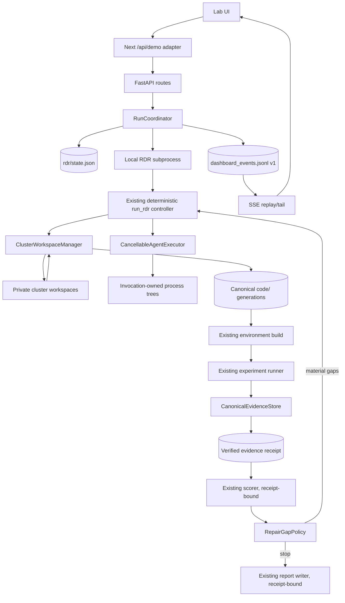

<!-- doc-meta: status=proposed; last-verified=2026-08-17 -->
# RDR production hardening and evidence-driven repair — implementation design

**Date:** 2026-08-17 · **Author:** operator + Codex · **Scope:** proposed, incremental
hardening of the existing Rubric-Driven Reproduction (`rdr`) pipeline.

> **STATUS — PROPOSAL ONLY. No production code in this spec is implemented yet.**
> This design keeps the existing deterministic RDR controller and provider/runtime
> abstractions. It does not adopt NVIDIA AI-Q, LangGraph, Deep Agents, Dask, a new queue,
> or planner/researcher subagents.

## Human-review summary

**Decision: use NVIDIA's [AI-Q Deep Researcher architecture](https://docs.nvidia.com/aiq-blueprint/2.0.0/architecture/agents/deep-researcher.html)
as a pattern library, while partially redesigning four seams inside the existing RDR—not the
system.**

| We are adapting from NVIDIA | We are deliberately not adopting |
|---|---|
| Explicit orchestration boundaries inside the existing deterministic `run_rdr` controller | NVIDIA AI-Q, LangGraph/Deep Agents, Dask, or a framework migration |
| Typed durable state, isolated worker context, async lifecycle, resumable progress, and observability | New routing, clarification, planner, researcher, critic, or verifier agents |
| Bounded, structured gap analysis with deterministic stopping | Prompt-driven/unbounded research loops or broad stacked retry middleware |
| Deterministic provenance verification: one canonical experiment receipt shared by score, repair, and report | Web search/source-registry/citation machinery inside RDR; model specialization without benchmarks |
| Narrow failure middleware for defects observed in this codebase | A new queue, microservices, WebSockets, distributed infrastructure, or wholesale NVIDIA topology |

The implementation therefore delivers four deep changes: private cluster workspaces with
deterministic merge and process-tree cancellation; a typed/idempotent/resumable run coordinator;
stable replayable SSE; and canonical evidence plus evidence-driven repair. Rollout is phased,
default-off where authority changes, reversible, and benchmark-gated.

**Explicit exclusion requested by the operator:** prior recommendation/action **2**—authoritative
LLM cost accounting and token/USD/invocation budget enforcement—is not part of this spec. Do not
modify cost ledgers, pricing, `RunBudget`, max-USD or invocation limits, or budget UI.

Reviewer approval should mean agreement with the decisions and invariants below, not approval
for a rewrite. Each phase is reversible and preserves the legacy path until its acceptance gate
passes.

---

## 1. Why this spec exists

The architecture review found that OpenResearch's `rdr` is a deterministic PaperBench
reproduction harness, not a general-purpose web deep-research agent. Its valuable core is:

- deterministic rubric decomposition and controller-owned phase ordering;
- bounded parallel Code Development clusters followed by a sequential dependency tail;
- real experiment execution and artifact-based reporting;
- a provider-neutral `AgentRuntime` and explicit tool registry;
- strong controller-level tests and file-backed run artifacts.

Those properties should remain. The production risks are narrower but material:

1. concurrent agents write and snapshot one shared live `code/` directory;
2. task cancellation cannot stop the worker thread or its descendants;
3. the HTTP RDR start/resume path does not preserve the controller's actual contract;
4. marker-only checkpoints cannot prove what code or commands they represent;
5. status/event projections can contradict the returned `RdrResult` and cannot replay exactly;
6. experiment, score, repair, and report can select related evidence independently;
7. repairs are selected by an LLM-derived threshold rather than explicit material evidence gaps.

NVIDIA AI-Q 2.0 is a useful reference for provenance, bounded workflows, role clarity,
resumable events, and deterministic citation hygiene. It is not an implementation template:
its documented `max_loops` is not an executable loop bound in the tagged source, much of its
gap handling is prompt-defined, its source registry proves retrieval rather than claim support,
and its framework/agent split does not match RDR's reproduction problem. This design therefore
adapts the principles that solve observed defects and rejects framework-shaped complexity.

### 1.1 Observed implementation baseline

The following are observed facts in the repository at `a2bf5a81`, not recommendations:

| Area | Current implementation | Consequence |
|---|---|---|
| Cluster execution | `backend/agents/rdr/agent.py::_reproduce_inner` uses `ctx.project_dir / "code"` for every ordinary cluster | Parallel agents can see and overwrite sibling in-progress work |
| Merge | `backend/agents/rdr/controller.py::_merge_cluster_files` runs as each task completes | Completion order can decide same-path output; unsupported writes can be skipped partially |
| Commands | `_dedup_commands(done)` observes completion insertion order | `commands.json` ordering is schedule-dependent |
| Cancellation | `_run_sdk_in_thread` abandons a timed-out `ThreadPoolExecutor`; `asyncio.wait_for` only cancels the awaiting task | Timed-out tools can keep running or writing; process-wide descendant reaping can affect siblings |
| Start validation | `StartRunRequest.paper_id` is optional; the generated child rejects it later | Invalid RDR starts can return 202 before failing |
| Source routing | upload/arXiv routes can accept `mode=rdr`, while the CLI RDR branch expects a PaperBench bundle | PDF RDR requests enter an impossible contract |
| Resume | REST reconstruction drops `paper_id` and does not pass `resume=True` | REST resume is a restart over preserved files, not RDR checkpoint resume |
| Checkpoints | cluster/repair JSON stores flags and counts but no commands, file manifest, or digests | A copied, failed, stale, or corrupt marker may be treated as completed |
| Terminal state | generated child unconditionally writes API status `completed` after any non-raising return | `RdrResult(status="partial")` is erased |
| SSE | connection-local IDs; replay begins at byte zero; generic RDR events are nested under `dashboard_event` | No exact resume/deduplication; frontend type guards can discard RDR events |
| Evidence | `backend/agents/rlm/evidence_bundle.py` exists behind a default-off fail-soft flag | RDR can still score/report independently selected artifacts |
| Repair | `run_rdr` repairs every cluster below `repair_target` for at most N passes | Bounded, but gaps are unstructured and LLM score is workflow authority |

### 1.2 Code traceability for the observed facts

Line references were verified on 2026-08-17 at the commit above; symbols/contracts are the durable
reference if later edits move lines.

| Observation | Current evidence |
|---|---|
| Shared ordinary cluster workdir and whole-tree snapshot | `backend/agents/rdr/agent.py:280-321,454-546`; `backend/agents/rdr/models.py:93-112` |
| Context hides peer `done` records but filesystem does not | `backend/agents/rdr/controller.py:622-632` |
| Task-only timeout, completion-ordered publish/merge | `backend/agents/rdr/controller.py:656-710`; thread abandonment at `backend/agents/rdr/agent.py:122-192` |
| Per-file merge lock and silent same-path overwrite | `backend/agents/rdr/controller.py:374-416` |
| Completion-order command assembly | `backend/agents/rdr/controller.py:272-278`; timing-dependent legacy test at `tests/rdr/test_controller_parallel.py:275-310` |
| Marker-only cluster checkpoint and placeholder resume | `backend/agents/rdr/controller.py:281-301,889-924`; copied-marker behavior at `tests/rdr/test_controller.py:1107-1194` |
| Score-threshold repair and stale-result risk | `backend/agents/rdr/controller.py:1261-1411`, especially exception path `:1370-1387` |
| Flat request with optional `paper_id`; late child failure | `backend/services/events/live_runs.py:176-235,2696-2703` |
| REST resume drops RDR identity/flag | `backend/services/events/live_runs.py:792-874,2411-2441,2696-2716` |
| Initial status omits canonical request/revision | `backend/services/events/live_runs.py:2276-2322` |
| Returned `partial` overwritten by wrapper completion | `backend/agents/rdr/controller.py:1518-1540`; `backend/services/events/live_runs.py:2706-2737` |
| Upload/arXiv admits a source the RDR bundle path cannot consume | `backend/app.py:410-545`; `backend/services/events/live_runs.py:2619-2647`; `backend/cli.py:1840-1844` |
| Connection-local SSE replay and nested RDR discriminator | `backend/services/events/live_runs.py:949-1016`; `backend/agents/dashboard_emitter.py:265-280` |
| Next/UI omits fixture `paperId` unless separately supplied and lacks durable replay IDs | `frontend/src/hooks/use-run.ts:474-505`; `frontend/src/app/api/demo/route.ts:231-272`; `frontend/src/app/api/demo/events/route.ts:102-140,279-289` |
| Receipt is default-off, partial, and currently minted during reporting | `backend/agents/rlm/evidence_bundle.py:1-46,208-388`; `backend/agents/rlm/report.py:1171-1207` |
| Correct successful-experiment persistence seam | `backend/agents/rlm/primitives.py:4855-4898,4948-4960,4992-5084` |
| Scorer independently scans metrics/provenance/current code | `backend/evals/paperbench/leaf_scorer.py:302-567,1669-1757` |

The observed facts above drive the scope. Claims about impact (for example, that shared writes can
produce schedule-dependent output) are engineering inferences backed by those paths and the
timing-dependent tests; the proposed modules below are recommendations.

The existing abstractions to reuse are:

- `backend/agents/runtime/base.py::{AgentRuntime, AgentRuntimeSpec, ToolSpec}` and the
  provider factory/adapters;
- `backend/agents/rdr/models.py` for RDR domain records;
- `backend/agents/rlm/evidence_bundle.py` and deterministic claim-grounding helpers;
- `backend/services/context/workspace/tools/interface.py::WorkspaceTool` returning
  `Cited[Any]`;
- `backend/schemas/citations.py::Citation` and
  `backend/services/context/indexer/model.py::SourceRef`;
- the existing JSONL/dashboard transport, evolved rather than duplicated;
- file-backed operation under `runs/<project_id>/`, consistent with the current single-user
  architecture.

---

## 2. Scope, goals, and non-goals

### 2.1 Goals

This work is complete only when all of the following are true:

1. Parallel completion order cannot change the canonical code tree, command order, merge
   manifest, or conflict winner for fixed inputs.
2. A timed-out, cancelled, or stopped cluster has no surviving local process able to execute
   tools or mutate its workspace when the outcome is returned.
3. A valid public RDR request names a registered PaperBench bundle; impossible source/mode
   combinations fail before files are created or a process is spawned.
4. Repeating a start with the same idempotency key and canonical request launches at most one
   run; reusing the key for a different request is a conflict.
5. Resume restores the immutable request and verified artifacts/commands, reruns failed or
   unverifiable work, and starts from the first incomplete durable phase.
6. `completed`, `partial`, `failed`, `stopped`, and `interrupted` propagate unchanged through
   state, REST, SSE/replay, and frontend terminal handling.
7. Reconnecting after event N yields every persisted event `> N` in order without a duplicate.
8. Scoring and final reporting resolve the same verified experiment/code receipt in enforcement
   mode; unverified evidence never silently becomes authoritative.
9. Repair decisions are persisted as structured gaps with evidence references and deterministic
   stop reasons. LLM scores/notes may propose or prioritize work but do not prove a gap closed.
10. Every rollout phase is independently deployable, testable, measurable, and reversible.

### 2.2 Explicit non-goals

- **No cost/budget implementation (operator's “ignore 2”).** No correction of RDR ledger
  placement, no pricing work, no max-token/max-USD/max-invocation authority, no budget UI.
  Existing wall-clock deadlines may be consumed by the cancellation module; their policy is not
  redesigned here.
- No NVIDIA AI-Q, LangGraph, LangChain Deep Agents, Dask, or agent-framework migration.
- No new planner, researcher, critic, verifier, router, or clarifier LLM role.
- No web search or external-source registry inside `rdr`; no LLM-generated URL workflow.
- No distributed scheduler, queue, microservice split, Kubernetes, or GKE. A durable distributed
  job substrate is a future scale decision, not a prerequisite for making the local architecture
  correct.
- No rewrite of RLM, CLI campaigns, cloud experiment backends, rubric decomposition, or the
  provider-neutral runtime.
- No promise that killing a local worker can recall a request already accepted by a remote LLM
  provider. The guarantee is that no owned local process/tool execution survives.
- No silent migration of arbitrary absolute `paper_id` paths into the public API. Absolute bundle
  paths remain an operator-trusted CLI capability only.

### 2.3 Design principles

1. **Replace, do not layer.** Once a phase enables the new path, there is exactly one writer for
   canonical state, code, event IDs, and terminal status.
2. **Deep modules.** Filesystem copying, hashing, validation, journaling, cancellation, transition
   rules, and replay live behind small public surfaces; the controller coordinates them.
3. **Deterministic authority.** Digests, manifests, state transitions, conflict resolution,
   evidence receipts, event IDs, and stopping rules are code, not prompts.
4. **Evidence, not grade.** LLM judgment is advisory context. Measured artifacts and verified
   receipts establish workflow facts.
5. **Fail closed on authority; fail soft on branches.** One failed cluster may produce a partial
   run, but invalid state/evidence cannot be presented as verified success.
6. **Default-off migration.** New authoritative behavior begins in shadow mode; unset flags retain
   existing behavior until the paired evaluation gate is approved.

### 2.4 NVIDIA reference-pattern disposition in this implementation

| NVIDIA idea | Decision for RDR | Implementation consequence |
|---|---|---|
| Intent routing | Reject for this flow | `mode="rdr"` is an explicit product/API choice over a bundle; no routing LLM |
| Clarification | Reject for this flow | PaperBench rubric/bundle is the closed-world objective; invalid input is schema error, not a chat turn |
| Orchestrator | Already exists / deepen | Keep `run_rdr`; move mechanics behind the four deep modules |
| Separate planner | Reject | Deterministic rubric decomposition is the plan and is more testable |
| Separate researcher | Reject | Cluster coding agents remain workers; no new web-research role |
| Iterative research | Adapt | Evidence-driven, bounded repair over reproduction gaps, not an open agent loop |
| Structured gap analysis | Adopt | Typed deterministic/advisory gaps, fingerprints, actions, and stop reasons |
| Explicit state/context isolation | Adopt | Versioned state plus private cluster workspaces and verified manifests |
| Tool/model middleware | Adapt narrowly | Schema validation, process ownership, and observed SDK failure handling only; no generic retry stack |
| Model specialization | Defer | Existing provider/runtime configurability remains; no per-role models without an ablation |
| Source registry | Defer outside RDR | Future external enrichment must reuse `SourceRef`/`Citation`/`Cited` after §17 benchmark |
| Deterministic citation verification | Defer for web; adapt principle | Experiment evidence uses deterministic receipt verification now; web citations wait for enrichment scope |
| Async jobs | Adapt current path | Preserve 202 + local subprocess, add idempotency/leases/resume/cancellation; no queue yet |
| Observability/streaming | Adopt | Stable typed event log, replayable SSE, state/receipt/gap metrics |

This table is the build-vs-adopt decision: use the valuable control/provenance principles without
copying NVIDIA's framework, agent count, prompt conventions, or deployment topology.

---

## 3. Target architecture



There are four new deep modules, all in-process/file-backed:

1. **`ClusterWorkspaceManager`** owns private workspaces, deltas, deterministic merge,
   generation manifests, and crash recovery.
2. **`CancellableAgentExecutor`** owns one invocation's worker process tree and teardown.
3. **`RunCoordinator`** owns command validation, idempotent admission, versioned state, run lease,
   resume fencing, terminal projection, and event subscription.
4. **`CanonicalEvidenceStore` + `RepairGapPolicy`** own receipt resolution, structured gap facts, and
   bounded stop decisions.

They are modules/classes, not service boundaries. Do not create abstract provider interfaces for
them until a second production implementation exists. Existing provider variation stays behind
`AgentRuntime`; test doubles may use Python structural typing/injected callables without adding a
new framework.

---

## 4. Domain vocabulary and invariants

| Term | Definition |
|---|---|
| **RDR run** | One stable `project_id` lineage for one immutable normalized request |
| **Attempt** | A process generation within that run; resume increments `attempt` |
| **Phase** | A durable controller barrier: decompose, clusters, assemble, environment, experiment, score, repair, finalize |
| **Wave** | A set of independent cluster attempts that all start from one canonical code digest |
| **Cluster attempt** | One initial, repair, or BES candidate invocation for one cluster |
| **Private workspace** | A physical copy/reflink of a wave base used by exactly one cluster attempt |
| **Canonical code tree** | `runs/<id>/code/`; only the workspace manager may replace it |
| **Delta** | Validated create/edit/delete/mode changes plus commands from one workspace against its base |
| **Merge manifest** | Immutable record binding wave base, ordered deltas, conflicts, accepted attempts, and result digest |
| **Evidence receipt** | Immutable binding of one successful experiment attempt, metrics bytes, code digest, ledger sequence, artifact directory, and coordinates |
| **Repair gap** | A typed missing/invalid material fact with evidence references, severity, and an allowed action |
| **Event ID** | Strictly increasing unsigned integer over the complete run lineage, including resumes |
| **Run lease** | Exclusive, fenced ownership of mutations for one active attempt |

Load-bearing invariants:

- An agent never receives canonical `code/` as its working directory.
- Every attempt in a parallel wave has the same base-tree digest and cannot observe sibling writes
  through its assigned worktree/tool root. Host-local Bash is not a hostile-code boundary (§11).
- Canonical code is unchanged while a wave's agents run.
- Only a successful atomic wave commit mutates canonical code.
- Fixed base, ordered deltas, and policy produce the same result regardless of task scheduling.
- A cluster delta is accepted or rejected as a whole; invalid files are never silently omitted.
- Failed, timed-out, cancelled, validation-failed, or merge-conflicted attempts contribute no
  files and no commands.
- A timeout/cancellation outcome is not observable until the owned local process tree is gone.
- Cancelling one cluster cannot terminate a sibling; cancelling the run reaps all active clusters
  and then propagates `CancelledError`.
- A checkpoint is complete only if every referenced manifest/path/digest verifies.
- State `revision`, run `attempt`, and event `event_id` increase monotonically.
- Stale attempt writers cannot mutate state, events, or canonical artifacts.
- `demo_status.json` is a compatibility projection, not state authority.
- A terminal state is written once, projected everywhere, and never upgraded by a liveness poll.
- Scorer and reporter use one verified receipt; an evidence mismatch yields `unverified`, never a
  fallback that is described as authoritative.
- Repair terminates at a recorded stop reason; no prompt can extend its bounds.

---

## 5. Deep module A — isolated, deterministic cluster workspaces

### 5.1 Placement and public surface

Add `backend/agents/rdr/workspaces.py`. Its entire controller-facing surface is:

```python
@dataclass(frozen=True, order=True)
class AttemptKey:
    phase: Literal["initial", "repair", "candidate"]
    pass_index: int
    cluster_ordinal: int
    cluster_id: str
    candidate_index: int | None = None


@dataclass(frozen=True)
class WorkspaceRef:
    key: AttemptKey
    root: Path
    code_dir: Path
    base_tree_digest: str


@dataclass(frozen=True)
class WorkspaceDelta:
    key: AttemptKey
    base_tree_digest: str
    changes: tuple[FileChange, ...]       # canonical path order
    commands: tuple[str, ...]
    delta_digest: str


@dataclass(frozen=True)
class MergeReport:
    wave_id: str
    before_tree_digest: str
    after_tree_digest: str
    accepted: tuple[AttemptKey, ...]
    rejected: tuple[AttemptKey, ...]
    conflicts: tuple[MergeConflict, ...]
    commands: tuple[str, ...]
    manifest_path: Path


class ClusterWorkspaceManager:
    def begin_wave(
        self,
        *,
        canonical_code_dir: Path,
        attempts: Sequence[AttemptKey],
        paper_path: Path,
    ) -> WorkspaceWave: ...


class WorkspaceWave:
    def workspace_for(self, key: AttemptKey) -> WorkspaceRef: ...
    def capture(self, key: AttemptKey) -> WorkspaceDelta: ...
    def commit(self, deltas: Sequence[WorkspaceDelta]) -> MergeReport: ...
```

The manager hides workspace allocation, copy/reflink selection, file validation, hashing,
three-way merge planning, staging, atomic replacement, manifest writes, recovery, and cleanup.
The controller must not manipulate workspace paths directly.

### 5.2 Filesystem layout

```text
runs/<project_id>/
  code/                                      # canonical assembled generation only
  paper_full.md
  rdr/
    state.json                               # §7 canonical run state
    state.lock
    workspaces/
      <attempt>/<wave>/<ordinal>-<id-hash>/
        paper_full.md
        code/
    merges/
      <attempt>-<wave>.json
    merge-journal.json                       # present only during interrupted commit
```

The workspace slug contains the canonical ordinal and a short hash of the raw cluster ID;
sanitization alone can collide. Workspaces are real copies or verified copy-on-write reflinks,
never hardlinks: an in-place agent edit through a hardlink would mutate the base inode.

`paper_full.md` is copied into each workspace root so the current `../paper_full.md` prompt
contract keeps working without exposing the run root as writable scope.

### 5.3 Capture rules

Capture compares the private tree against the immutable wave base and records:

- create, edit, delete, and executable-bit change;
- POSIX-normalized relative path;
- before/after SHA-256, byte size, and content location;
- parsed commands and validation diagnostics.

`commands.json` is parsed as metadata and excluded from file changes. The controller exclusively
synthesizes canonical `commands.json` from accepted deltas.

Reject the complete delta for any changed:

- absolute or traversal path;
- symlink, hardlink escape, device, socket, or FIFO;
- reserved control path under `rdr/`, `iterations/`, or report/state files;
- file exceeding the configured artifact size limit;
- unsupported binary/encoding when the current `Artifacts` contract cannot represent it;
- path whose resolved parent escapes the workspace.

Rejection is explicit in the delta/merge report. Do not preserve today's silent skip behavior.

### 5.4 Deterministic three-way merge

At commit:

1. Verify canonical tree digest still equals the wave base. Otherwise return an
   `external_mutation` conflict and mutate nothing.
2. Sort deltas by `AttemptKey`; never consume completion/insertion order.
3. For each proposed path, compare base, already accepted result, and proposal:
   - accepted equals base: apply proposal;
   - proposal equals accepted: convergent identical change, accept as no-op;
   - otherwise: record `edit_edit`, `edit_delete`, or `delete_edit` conflict.
4. If any path conflicts, reject that attempt's whole delta and its commands. The lower canonical
   ordinal is the deterministic winner. The loser becomes a structured `merge_conflict` repair
   gap; no LLM resolves the merge.
5. Build the complete next tree in a staging generation, validate it, write/fsync the merge
   manifest, write a recovery journal, and atomically swap. Clear the journal only after the
   canonical digest verifies.
6. Order commands by accepted `AttemptKey`, exact-string deduplicate, and keep the first canonical
   occurrence.
7. Persist completion checkpoints only after the merge manifest is durable.

Sequential Code Execution/Result Analysis attempts are one-item waves created from the latest
committed generation, so each sees its dependencies naturally. Parallel repair clusters use the
same wave rules. BES candidate scratch directories are migrated to the same manager; only the
selected candidate's delta enters the containing cluster wave.

### 5.5 Crash recovery

On startup/resume, the manager examines `merge-journal.json`:

- no journal: verify current canonical manifest/digest and continue;
- journal + canonical digest equals `before`: remove incomplete staging and retry commit;
- journal + canonical digest equals `after`: ensure manifest exists, finalize checkpoint, clear;
- any other digest: mark state `interrupted` with `canonical_tree_ambiguous`; require explicit
  operator recovery—never guess between mixed trees.

The successful-return guarantee is old complete tree or new complete tree, never a partially
applied cluster delta.

---

## 6. Deep module B — cancellable invocation-owned process trees

### 6.1 Placement and surface

Add `backend/agents/rdr/execution.py` and a child entry point
`backend/agents/rdr/worker_main.py`.

```python
@dataclass(frozen=True)
class AgentInvocation:
    invocation_id: str
    cluster_id: str
    prompt_path: Path
    workspace: WorkspaceRef
    runtime_spec: AgentRuntimeSpec
    deadline_monotonic: float
    worker_report_root: Path


@dataclass(frozen=True)
class AgentOutcome:
    invocation_id: str
    status: Literal["completed", "failed", "timed_out", "cancelled"]
    notes_path: Path | None
    error: str
    started_at: str
    finished_at: str


class CancellableAgentExecutor:
    async def execute(self, request: AgentInvocation) -> AgentOutcome: ...
    async def cancel(self, invocation_id: str, *, reason: str) -> None: ...
    async def cancel_all(self, *, reason: str) -> None: ...
```

This is one concrete deep module, not a second agent-runtime abstraction. The child reconstructs
the existing `AgentRuntime` from `AgentRuntimeSpec`/the provider factory and may continue to use
`collect_agent_text` plus `sdk_isolation` internally. A wedged SDK thread is contained in a worker
process the parent can kill.

### 6.2 Ownership and cancellation contract

- Launch one child worker per invocation with a serializable, non-secret request.
- On POSIX create an invocation-owned session/process group; on Windows use a Job Object (or an
  equivalent tested tree-kill primitive). Record PID plus process creation identity to prevent PID
  reuse mistakes.
- Reuse the credential-vault one-shot pipe pattern. Credentials never enter request JSON, disk,
  logs, or the child's `execve` environment.
- On deadline, controller cancellation, or explicit stop: send TERM/cancel, wait a bounded grace,
  send KILL, wait/reap, verify no owned descendants remain, close pipes, then return/raise.
- Never select processes by executable name and never reap all `claude` descendants of the run;
  ownership comes only from the stored process handle/tree.
- Do not swallow parent `CancelledError`. `run_rdr` waits for all executor teardowns, commits no
  pending deltas, then re-raises.
- A timeout racing normal completion has exactly one terminal outcome, chosen under the executor's
  invocation lock.
- After returning `timed_out`/`cancelled`, both the worker PID tree and workspace bytes are stable.
- Remote provider work already accepted may continue remotely; it cannot execute local tools after
  the worker is gone.

The run subprocess itself must also start in an owned process group/session. `stop_run` terminates
and verifies the orchestrator tree before persisting `stopped`. A liveness sweeper may mark a lost
orchestrator `interrupted`; it must not race a stop into another terminal state.

### 6.3 Controller integration

Refactor a batch as a barrier:

1. `begin_wave` and allocate all workspaces from the same base.
2. Build contexts/prompts against accepted prior artifacts only.
3. Execute clusters concurrently through `CancellableAgentExecutor`.
4. Gather structured outcomes while preserving outer cancellation.
5. Capture deltas for completed workers only.
6. Commit all deltas once in canonical order.
7. Update accepted artifacts, emit events, and checkpoint from `MergeReport`.

Remove the legacy shared-write path from a run when the new path is enabled:

- no normal fallback from `AgentContext.workspace` to `ctx.project_dir / "code"`;
- no `_run_sdk_in_thread` in RDR agent code;
- no `done_lock` or per-file `file_merge_lock`;
- no `_merge_cluster_files` or production `_ClusterWatchdog`;
- no process-global sibling-unsafe descendant reaper in parallel RDR.

Worker reports, telemetry, and invocation notes must receive explicit run-output roots. They must
not infer the run root from the now-deeper workspace `code/` layout.

---

## 7. Deep module C — typed run coordination, state, and resume

### 7.1 Public coordinator surface

Add a cohesive package under `backend/services/runs/` (or deepen the existing package rather than
creating peer wrappers):

```text
backend/services/runs/
  contracts.py        # HTTP-neutral command/snapshot/event Pydantic models
  rdr_state.py        # state schema, legal transitions, atomic file store
  coordinator.py      # admission, lease, spawn/resume/stop, projections
```

The FastAPI routes, `FileLiveRunService`, and Next proxy become thin adapters to one concrete
`RunCoordinator`:

```python
class RunCoordinator:
    async def start(
        self, command: StartRdrRunV1, *, idempotency_key: str
    ) -> StartResult: ...

    async def resume(
        self, run_id: str, command: ResumeRunV1
    ) -> ResumeResult: ...

    async def get(self, run_id: str) -> RunSnapshotV1 | None: ...
    async def stop(self, run_id: str) -> RunSnapshotV1 | None: ...

    async def subscribe(
        self, run_id: str, *, after_event_id: int | None
    ) -> AsyncIterator[RunEventV1]: ...
```

This is a module interface, not a new network service or storage abstraction. Keep the file-backed
implementation until a real second deployment need justifies another adapter.

### 7.2 Public RDR command

Normalize every legacy route/query/form into one discriminated command before creating a run:

```python
class PaperBenchBundleSourceV1(BaseModel):
    model_config = ConfigDict(extra="forbid")
    kind: Literal["paperbench_bundle"]
    paper_id: str


class StartRdrRunV1(BaseModel):
    model_config = ConfigDict(extra="forbid")
    schema_version: Literal[1] = 1
    mode: Literal["rdr"]
    source: PaperBenchBundleSourceV1
    execution: RdrExecutionOptionsV1
```

Rules, evaluated before directory creation/spawn:

- `paper_id` is a known registry-relative PaperBench bundle ID; blank, traversal, absolute paths,
  and unknown IDs are 422 for public HTTP.
- `/runs/upload` and `/runs/arxiv` with `mode=rdr` are 422
  `unsupported_source_for_mode`. RDR requires a rubric bundle; a PDF is not one.
- Invalid enum/bool/int values are 422, not silently normalized form defaults.
- Extra fields are rejected at the v1 boundary.
- CLI retains its trusted absolute bundle-path capability.
- The legacy flat `POST /runs` shape remains a temporary adapter and emits the same normalized
  command; it does not remain a second execution path.

The Next fixture request must include `paperId` whenever `runMode === "rdr"`. The UI must not offer
RDR for upload/arXiv unless a future explicit bundle-construction flow exists.

### 7.3 Idempotent admission

`Idempotency-Key` is required on the lab start path (opaque safe ASCII, 1–128 characters). The
frontend creates one UUID per user start action and reuses it for its network retry; Next forwards
it unchanged.

Coordinator semantics:

- canonicalize the normalized command and compute `request_sha256`;
- hash—not store—the idempotency key; use it to derive/claim one stable project ID under an
  interprocess file lock;
- same key + same request returns the existing run with `replayed=true` and never archives/spawns;
- same key + different request returns 409 `idempotency_key_reused`;
- same key after a terminal run returns that terminal run; resume is a distinct operation;
- reserve, initial state write, and spawn intent are recoverable: if the parent crashes between
  them, retry either adopts the recorded live process or performs the one unfulfilled spawn;
- one active lease exists per run, so 20 concurrent identical starts result in one process.

Response contract:

```json
{
  "schemaVersion": 1,
  "accepted": true,
  "replayed": false,
  "run": {"projectId": "...", "status": "queued", "attempt": 1, "revision": 1}
}
```

Return 202 for both first admission and same-key replay to keep client behavior stable.

### 7.4 Canonical state schema

Use `runs/<id>/rdr/state.json`, not the falsely documented/nonexistent RDR
`pipeline_state.json`. Version-1 Pydantic schema (abridged):

```json
{
  "schema_version": 1,
  "project_id": "ui_rdr_...",
  "attempt": 2,
  "revision": 37,
  "request_sha256": "...",
  "request": {
    "mode": "rdr",
    "source": {
      "kind": "paperbench_bundle",
      "paper_id": "...",
      "bundle_sha256": "...",
      "rubric_sha256": "...",
      "paper_sha256": "..."
    },
    "execution": {}
  },
  "status": "running",
  "phase": "clusters",
  "progress": {
    "decomposition": {"status": "completed", "artifact": "...", "digest": "..."},
    "clusters": {},
    "assembly": {},
    "environment": {},
    "experiment": {},
    "scoring": {},
    "repairs": {},
    "report": {}
  },
  "resume": {"resumable": true, "next_phase": "clusters", "checkpoint_version": 1},
  "process": {"kind": "local", "pid": 1234, "pid_host": "..."},
  "last_event_id": 81,
  "started_at": "...",
  "updated_at": "...",
  "completed_at": null,
  "terminal": null
}
```

Use enums and typed nested models, never `dict[str, Any]` for authoritative progress. State stores
references/digests, not full paper text, code, prompts, credentials, or large outputs.

Canonical statuses:

```text
queued | running | completed | partial | failed | stopped | interrupted
```

Canonical phases:

```text
accepted -> decomposing -> clusters -> assembling -> environment -> experiment
         -> scoring -> [repairing -> experiment -> scoring]* -> finalizing -> terminal
```

From any active phase, operator stop goes to `stopped`; verified process loss goes to
`interrupted`. `completed`, `partial`, `failed`, `stopped`, and `interrupted` are terminal. Do not
keep a separate UI-only `killed` synonym.

### 7.5 Store and fencing semantics

The state module owns:

- an OS-level per-run file lock;
- read/validate supported schema version;
- compare-and-swap on expected `(attempt, revision)`;
- legal transition validation;
- temp-file write, flush/fsync, atomic replace, and parent-directory fsync;
- legacy `demo_status.json` projection after canonical commit.

State transition plus event publication uses a small transactional outbox in canonical state:

1. under the run lock, validate the transition, allocate the next event ID, and atomically commit
   the new state with a bounded `pending_events` entry;
2. append/fsync that exact envelope idempotently to `dashboard_events.jsonl`;
3. atomically acknowledge/remove the outbox entry without allocating another event;
4. after a crash, flush pending entries before accepting new mutations. If the ID already exists
   with the same envelope digest, acknowledge it; a different payload for the same ID is corruption
   and transitions the run to interrupted.

This avoids pretending JSON state plus JSONL append are one filesystem transaction. A durable state
transition can temporarily wait in the outbox, but it cannot be lost or assigned a second ID.

Unsupported future schemas return `state_version_unsupported`; they are not interpreted as legacy.
`demo_status.json` remains readable during migration but becomes a one-way compatibility
projection. All mutations route through the coordinator. The child reports typed transitions to
the store; API stop/resume uses the same store. Stale attempt/revision mutations are rejected.

### 7.6 Checkpoint schema and resume algorithm

Every durable phase record contains:

- status `pending | running | completed | failed | timed_out | cancelled | conflict`;
- attempt/pass/cluster identity;
- canonical input/config/rubric digest;
- output paths relative to run root, sizes, and SHA-256;
- relevant merge/evidence manifest digest;
- commands and structured failure;
- start/end timestamps.

Write outputs first, verify, then commit the completed checkpoint. A completed cluster may be
skipped only if its merge manifest, delta digest, result tree digest, request/rubric digest, and
referenced artifacts verify. Failed, timed-out, cancelled, conflicted, missing, stale, copied, or
corrupt checkpoints rerun.

Resume:

1. acquire the exclusive run lease and reject a live competing owner;
2. allow only `failed`, `stopped`, or `interrupted` state with `resumable=true`;
3. load the immutable normalized request—including `paper_id`—and verify bundle fingerprints;
4. recover any workspace merge journal;
5. increment `attempt`, fence old writers, persist process spawn intent;
6. verify checkpoints in dependency order and compute the first incomplete phase;
7. hydrate real accepted artifacts and commands from manifests, never empty placeholders;
8. invoke `run_pipeline_rdr(..., resume=True)` with a typed resume cursor;
9. rerun only incomplete/unverifiable work, preserving lineage and event sequence;
10. persist the returned terminal result exactly.

An uninterrupted and resumed run with deterministic fake providers must yield byte-identical
canonical code, commands, evidence receipt, score inputs, and final report except timestamps,
process metadata, and attempt lineage.

### 7.7 Terminal authority

Change `RdrResult.status` from an unconstrained string to a typed enum. The subprocess wrapper
captures its return and calls one coordinator transition. It must never write unconditional
`completed`.

Mapping is identity:

| RDR outcome | Canonical/API/UI status |
|---|---|
| verified normal result | `completed` |
| honest usable-but-incomplete result | `partial` |
| returned terminal failure | `failed` |
| uncaught exception | `failed` with typed safe error |
| acknowledged operator cancellation | `stopped` |
| process disappeared without terminal transition | `interrupted` |

The liveness sweeper is the only owner of lost-process inference. `_load_run` must not independently
rewrite a dead PID to a conflicting terminal. Final state and terminal event are durable before
process exit.

---

## 8. Durable events, SSE, and frontend behavior

### 8.1 Event envelope

Evolve the existing `dashboard_events.jsonl`; do not create a second competing progress log.

```python
class RunEventV1(BaseModel):
    schema_version: Literal[1] = 1
    event_id: int                  # uint64, > 0
    project_id: str
    attempt: int
    type: str
    occurred_at: datetime
    payload: dict[str, JsonValue]
```

One event writer, invoked through the coordinator's state outbox (§7.5), owns interprocess locking,
sequence allocation, idempotent append/flush/fsync, payload size limits, and torn-tail recovery.
`event_id` is unique and strictly increasing for the complete run lineage across restarts/resumes.
State's `last_event_id` records the last allocated ID; `pending_events` records allocated but not yet
acknowledged envelopes.

Actual RDR types (`rdr_cluster_started`, `repair_dispatched`, `run.terminal`, etc.) live in `type`.
Never wrap them as `event="dashboard_event"` with a second hidden discriminator. During migration,
the reader may decode legacy rows, but all new rows use the envelope.

Corpus-leak rules remain: payloads contain IDs, counts, hashes, scores, statuses, and bounded safe
errors—not paper excerpts, prompts, file bodies, credentials, or full tool output.

### 8.2 SSE contract

`GET /runs/{id}/events`:

- returns HTTP 404 before constructing `StreamingResponse` for an unknown run;
- accepts `Last-Event-ID` and an equivalent validated `after` query for tests/non-browser clients;
- replays exactly rows with `event_id > cursor`, then tails the same file;
- sends `id: <event_id>`, `event: <type>`, and serialized envelope data;
- uses id-less comment heartbeats;
- persists before send;
- sends the terminal event and closes normally;
- if the cursor predates retained history, returns typed 410 `event_cursor_expired` with snapshot
  recovery metadata rather than silently replaying an ambiguous suffix.

The replay endpoint returns:

```json
{
  "events": [],
  "firstEventId": 1,
  "lastEventId": 81,
  "nextAfter": 81
}
```

Do not embed the full dashboard history inside each `run_state` payload. `GET /runs/{id}` returns a
snapshot and at most a small bounded recent-summary projection. This removes today's O(history)
read/transmit behavior.

### 8.3 Next/frontend changes

- Next forwards `Last-Event-ID`; it does not mint `synth-N` IDs.
- If UI state synthesis remains temporarily, synthesized frames have no replay ID and cannot
  advance the durable cursor. Prefer persisted `run.state_changed` events and remove synthesis.
- The client tracks the highest event ID per project, drops `<= lastSeen`, and explicitly resumes
  after that cursor when it replaces a failed `EventSource` with polling/reconnect logic.
- A shared `TERMINAL_STATUSES` includes `completed`, `partial`, `failed`, `stopped`, and
  `interrupted`; every one clears busy state and closes the stream.
- Frontend event guards accept the v1 envelope's `type`; the migration decoder also understands
  legacy top-level `event` and nested `dashboard_event` until old runs age out.
- Artifact polling does not permanently stop merely because the first three polls are empty; it
  stops at a terminal state or a bounded transport error policy that distinguishes 404 from 5xx.

---

## 9. Deep module D — canonical evidence and structured repair gaps

### 9.1 Reuse and deepen the existing receipt

Do not create a parallel “source registry” for RDR's experiment evidence. Move the authoritative
core once into `backend/agents/evidence/canonical.py` as one `CanonicalEvidenceStore` used by RLM
and RDR. Keep `backend/agents/rlm/evidence_bundle.py` as the default-off v1 migration/compatibility
facade until all callers and retained runs migrate; do not maintain two selectors.

The current bundle is insufficient as an authority because it is minted by
`backend/agents/rlm/report.py` during final-report construction, after in-loop scoring, and verifies
primarily the selected metrics path/hash. Current-code digest, ledger-row identity, path
containment, and every required artifact are not all revalidated. The authoritative mint seam is
`backend/agents/rlm/primitives.py::_persist_experiment_result`: immediately after a genuine-success
experiment row and its manifest/artifacts are durable, before any scorer or report can independently
select evidence.

Use a role-based receipt so the store remains deep when the artifact set grows:

```python
class ArtifactRef(BaseModel):
    role: Literal[
        "metrics", "code_manifest", "code_snapshot", "commands",
        "provenance", "artifact_manifest", "experiment_row",
        "rubric", "figure_sidecar", "predictions", "logs"
    ]
    path: str                     # normalized run-root-relative path
    sha256: str
    media_type: str | None = None
    required: bool = True


class EvidenceCoordinates(BaseModel):
    model_id: str | None = None
    env_id: str | None = None
    dataset_id: str | None = None
    baseline_id: str | None = None
    split: str | None = None
    seed: int | None = None
    source_track: str | None = None


class EvidenceReceiptV2(BaseModel):
    schema_version: Literal[2] = 2
    evidence_id: str              # SHA-256 of canonical payload without evidence_id
    project_id: str
    run_attempt: int
    experiment_attempt_id: str
    ledger_sequence: int
    coordinates: EvidenceCoordinates
    artifacts: tuple[ArtifactRef, ...]
    created_at: datetime
    producer: Literal["run_experiment", "migration"]
```

The workspace/experiment path must retain an immutable code manifest and code snapshot for each
successful experiment; hashing mutable current `code/` at report time is not sufficient. Copy or
reflink the tracked source generation into the experiment artifact directory, exclude the same
declared cache/output paths used by the workspace manager, and fail receipt minting if any tracked
file cannot be read. Do not silently skip unreadable source files when computing authority.

Persist immutable history plus one tiny selected pointer:

```text
runs/<id>/evidence/
  receipts/<experiment_attempt_id>.json
  canonical.json                 # evidence_id + receipt path/hash only
```

The canonical pointer is written only by the successful-experiment persistence seam; report code
never mints or changes it. Keep reading the legacy `rlm_state/evidence_bundle.json` only through a
v1 migration adapter.

```python
class ResolutionFailure(BaseModel):
    status: Literal["absent", "invalid", "tampered", "unsupported_version"]
    reasons: tuple[EvidenceFailureReason, ...]


class EvidenceSnapshot(BaseModel):
    receipt: EvidenceReceiptV2
    receipt_sha256: str
    resolved_artifacts: Mapping[str, ResolvedArtifact]
    fingerprint: str              # same as evidence_id


class CanonicalEvidenceStore:
    def mint_success(
        self, project_dir: Path, persisted_ledger_row: PersistedExperimentRow
    ) -> EvidenceReceiptV2: ...

    def resolve(
        self, project_dir: Path, *, experiment_attempt_id: str | None = None
    ) -> EvidenceSnapshot | ResolutionFailure: ...
```

Resolution validates schema and receipt hash; project identity; canonical pointer; normalized
run-relative, non-symlink-escaping paths; every required artifact digest; immutable code manifest
and snapshot; experiment ledger row index/content; artifact manifest; and coordinate consistency.
It resolves once per phase. Consumers never rescan a directory or choose files by mtime.

### 9.2 One evidence snapshot for score, report, and repair

Change the scorer's core signature from a run directory that it can rescan to an explicit snapshot:

```python
def score_reproduction(
    rubric_tree: RubricTree,
    evidence: EvidenceSnapshot,
    llm_client: LlmClient,
    *,
    degraded: bool,
) -> ReproductionAssessment: ...
```

Keep a temporary `run_dir` compatibility wrapper that calls `resolve` exactly once. Migrate
`backend/evals/paperbench/leaf_scorer.py`, `deterministic_leaf_checker.py`, scorer cache/evidence
gates, RDR controller, and report generation to the explicit snapshot. In particular:

- remove newest-`metrics.json` selection from authoritative paths;
- do not independently select provenance, sidecars, or current code;
- key scorer caches by `evidence_id` plus rubric/grader inputs, not mutable top-level metrics;
- stamp the same `evidence_id`, experiment attempt, and receipt hash on each assessment, repair
  decision, and final report;
- report copies verified authority; it never re-mints/reselects it.

Assessment makes absence/integrity explicit rather than fabricating a zero that looks graded:

```python
class LeafAssessment(BaseModel):
    leaf_id: str
    state: Literal["graded", "unavailable", "ungraded", "evidence_invalid"]
    score: float | None
    evidence_refs: tuple[EvidenceRef, ...]
    gaps: tuple[RepairGap, ...]
    grader_kind: str
    justification: str


class ReproductionAssessment(BaseModel):
    evidence_id: str | None
    overall_score: float | None
    coverage_pct: float
    eligible_count: int
    graded_count: int
    leaves: tuple[LeafAssessment, ...]
    gaps: tuple[RepairGap, ...]
    benchmark_eligible: bool
    ineligibility_reasons: tuple[str, ...]
```

Preserve the full evidence grid used by `grader_digest.py`; canonical selection must not narrow
multi-model/dataset/seed evidence to one convenient scalar.

### 9.3 Shadow and enforcement modes

Reuse `OPENRESEARCH_CANONICAL_EVIDENCE_BUNDLE`; do not create overlapping flags.

1. **Off:** legacy behavior, byte-identical.
2. **Shadow:** mint/verify v2 and record comparison diagnostics; scorer/report legacy selection is
   unchanged. A mismatch is observable, not authoritative.
3. **Enforce:** scorer and report resolve only through a verified receipt. Missing/unverified
   evidence yields an honest `partial` or `failed` result according to the existing phase outcome;
   no authoritative metric/claim is emitted.

Remove the current “verification mismatch then silently fall back to legacy” behavior in enforce
mode. Fail-soft remains valid in off/shadow mode; it is incompatible with authority once the flag is
approved.

### 9.4 Structured repair gaps

Add models to `backend/agents/rdr/gaps.py`:

```python
class RepairGap(BaseModel):
    gap_id: str                    # deterministic hash of material fields
    cluster_id: str
    leaf_ids: tuple[str, ...]
    kind: Literal[
        "cluster_failed",
        "cluster_timed_out",
        "artifact_invalid",
        "merge_conflict",
        "command_missing",
        "environment_failed",
        "experiment_failed",
        "metric_missing",
        "metric_out_of_tolerance",
        "provenance_mismatch",
        "protocol_mismatch",
        "aggregation_mismatch",
        "integrity_failure",
        "grader_unavailable",
        "ungraded",
        "advisory_low_score",
    ]
    authority: Literal["deterministic", "advisory"]
    disposition: Literal["repairable", "external_blocked", "review", "resolved"]
    severity: Literal["critical", "high", "medium", "low"]
    evidence_refs: tuple[EvidenceRef, ...]
    suggested_action: Literal[
        "rerun_cluster", "resolve_conflict", "rebuild_environment",
        "rerun_experiment", "rescore", "operator_review"
    ]
    fingerprint: str
```

`RepairGapPolicy.decide` consumes state, verified receipt, experiment outcome, deterministic
validators, and grader output. It returns:

```python
class RepairDecision(BaseModel):
    iteration: int
    action: Literal["continue", "stop_complete", "stop_stalled", "stop_blocked"]
    selected_gap_ids: tuple[str, ...]
    resolved_gap_ids: tuple[str, ...]
    deferred_gap_ids: tuple[str, ...]
    stop_reason: Literal[
        "material_gaps_closed",
        "no_material_information_gain",
        "repeated_gap_fingerprint",
        "max_iterations_reached",
        "deadline_reached",
        "terminal_failure",
        "operator_stop",
    ] | None
    input_digest: str
```

Rules:

- deterministic failures/manifests/receipts/metric comparisons create authoritative gaps;
- the LLM leaf scorer may create `advisory_low_score` and prioritize presentation, but its prose or
  scalar alone does not prove a material gap or successful closure;
- gap IDs/fingerprints are stable over normalized kind, target, evidence references, and action;
- progress means a targeted gap closed, its own evidence fingerprint changed, or a new applicable
  action became available; unrelated metric-file churn is not progress;
- repeat of the same unresolved gap IDs and per-gap evidence fingerprints after a repair is explicit
  low information gain and stops stalled after the configured repetition threshold;
- no repairable gaps stops complete; only `external_blocked`/`review` gaps stops blocked;
- merge conflicts target only rejected attempts; successful sibling work is retained;
- the policy may select fewer gaps than exist, but only by deterministic severity/order rules;
- grader parse/availability failure creates `grader_unavailable`; it does not erase other gaps;
- every decision and stop reason is persisted in state and emitted.

Persist the current `GapSet` and repair state atomically (either as typed nested RDR state or
`evidence/gaps.json` plus its digest in state). Replay with the same snapshot and observations must
produce the same gap IDs and stop decision.

### 9.5 Bounded loop and stale-evidence prevention

The current `max_repair_iterations` remains a hard safety ceiling. The new policy stops earlier on
material closure or repeated evidence fingerprint. It cannot exceed the ceiling or existing
wall-clock deadline.

Before each repair experiment set the in-memory experiment result to an explicit pending/failed
sentinel. If `run_experiment` raises, scoring must not reuse the previous successful `exp` object or
metrics as if they came from the repaired code. A new receipt is required for each successful code
generation; the receipt's immutable `code_manifest` and `code_snapshot` digests must match the code
generation that the repair experiment actually executed.

Rollout is shadow first: persist proposed gaps/decisions while the legacy threshold loop runs.
Authoritative mode may replace the legacy selector only after the evaluation in §14 shows no quality
regression and lower redundant repair rate. Never run both selectors as independent repair loops in
one job.

---

## 10. Failure semantics and graceful degradation

| Failure | Required behavior |
|---|---|
| One cluster returns error | Record failed attempt and material gap; continue independent siblings; final result may be partial |
| One cluster times out | Reap only its process tree, record timeout; no delta/commands; continue siblings |
| One cluster is cancelled by run stop | Reap it, commit no wave, propagate run cancellation after all teardown |
| Workspace delta invalid | Reject entire delta, preserve private workspace/diagnostic, create `artifact_invalid` gap |
| Same-path incompatible deltas | Deterministic lower ordinal wins; reject loser atomically; create `merge_conflict` gap |
| Canonical tree changes during wave | Abort commit without mutation; mark interrupted/external mutation |
| Process dies during merge | Recover old or new complete generation from journal; ambiguous digest interrupts fail-closed |
| State JSON torn/corrupt | Atomic writer should prevent; retain last valid backup, interrupt with typed diagnostic; never infer completion |
| Stale resume writer | CAS/attempt fence rejects mutation and event append |
| Environment build fails | Persist phase failure and gap; skip experiment requiring it; finalize honest partial/failed report |
| Experiment fails after a repair | Clear prior result; do not mint receipt or rescore against stale successful evidence |
| Evidence receipt mismatch | Shadow: diagnose and retain legacy output label; enforce: unverified, no authoritative claim |
| Scorer returns malformed/empty output | Schema-validate, retry only existing classified transient policy; deterministic evidence remains, score advisory/ungraded |
| Event append fails after state commit | State remains authority; retry/reconcile with a typed state-reconciliation event; do not roll back terminal state |
| Client disconnects | Run continues; reconnect resumes from last persisted event ID |
| Orchestrator disappears | Liveness owner verifies PID identity, transitions active run once to interrupted, preserves resume data |
| Stop requested twice | Idempotently returns the same stopped/terminal snapshot |

Partial failure must not be converted to `completed`, and an observability failure must not corrupt
canonical execution state. Conversely, failure to prove artifact/evidence integrity cannot be hidden
as a mere telemetry warning in authoritative mode.

---

## 11. Security requirements

Execution isolation is also the primary response to untrusted paper content. Prompt text alone is
not a sandbox.

1. **Treat paper/rubric text as data.** The cluster system prompt states that excerpts can contain
   untrusted instructions and cannot alter tools, output roots, or harness policy. Do not rely on
   this instruction for containment.
2. **Workspace containment.** Every harness-managed read/write target resolves below the private
   workspace; capture rejects symlinks and special files; canonical code and run control files are
   never passed as agent output roots. This is correctness isolation, not same-UID OS isolation.
3. **Process containment.** Child environment contains only required non-secrets plus one-shot
   credential handoff; termination owns descendants by handle/tree. Where the worker-isolation
   backend can enforce mount boundaries, mount only the assigned workspace/paper and make sibling,
   canonical, and control paths unavailable. In trusted-local mode, do not claim that `cwd` prevents
   malicious Bash from traversing the host filesystem.
4. **Credential discipline.** Reuse `credential_vault`; never serialize secrets in state, prompt
   files, worker request JSON, event payloads, reports, or `execve` environment.
5. **Public bundle confinement.** HTTP resolves registry IDs below the configured PaperBench root,
   verifies realpath containment, and never accepts absolute paths.
6. **Upload/arXiv hardening in the touched routes.** Reject RDR PDF modes. Independently enforce a
   backend byte cap and PDF magic/type validation for upload paths. Restrict the arXiv endpoint to
   expected arXiv hosts, revalidate every redirect, resolve DNS, and reject loopback/private/link-local
   destinations. This closes the observed SSRF route without inventing a generic crawler.
7. **Event/output hygiene.** Typed errors expose stable codes and bounded messages, never raw
   exception strings that may contain paths/secrets. Corpus and file contents never enter SSE.
8. **Run-path confinement.** Resume/rerun treats all persisted paths as untrusted, resolves them
   beneath the run root, and verifies hashes before reads.

Agent Bash remains necessary for reproduction. A fully sandboxed coding-agent runtime is a larger
future project; this design substantially reduces ordinary write/cancellation blast radius but must
not be described as a complete hostile-code sandbox. Until such a boundary exists, public RDR is
limited to operator-registered PaperBench bundles; arbitrary uploaded/arXiv PDFs are rejected, and
`trusted_local` is an explicit deployment posture rather than a security promise.

---

## 12. Observability and performance

This section intentionally excludes new cost accounting/budget enforcement.

### 12.1 Required structured fields

Every state transition/event/worker report includes, where applicable:

```text
project_id, attempt, revision, event_id, phase, cluster_id, cluster_ordinal,
invocation_id, wave_id, merge_manifest_digest, code_tree_digest,
experiment_attempt_id, evidence_receipt_digest, repair_iteration,
gap_ids, stop_reason, status, duration_ms, retry_count, error_code
```

Never use model prose as a metric label. Prompts/completions remain redacted or disabled by default.

### 12.2 Metrics

- active runs and active cluster workers;
- queued/started/completed/partial/failed/stopped/interrupted runs;
- p50/p95/p99 duration by RDR phase and cluster invocation;
- cluster success, timeout, cancellation, validation failure, and merge-conflict counts;
- orphan-process verification failures;
- state CAS conflicts and stale-writer rejections;
- resume attempts, phases skipped, checkpoints rejected by reason, resumed-run equivalence failures;
- SSE reconnects, replayed rows, duplicate rows dropped, cursor-expired responses, tail lag;
- evidence receipt verified/unverified/missing by reason;
- repair gaps by kind, iterations, repeated-fingerprint stops, early-stop rate, redundant-repair rate;
- canonical tree and merge recovery failures.

Existing token/provider telemetry may continue to be recorded, but this implementation must not
alter its accounting or make it authoritative.

### 12.3 Expected performance effects (estimates, benchmark before default flip)

| Change | Latency/throughput effect | Mitigation/gate |
|---|---|---|
| Private workspace creation | Extra local I/O before each wave | Prefer verified reflinks; measure copy bytes/time; correctness never depends on reflink support |
| Barrier merge | Slowest parallel cluster gates wave commit | Parallel agents already form a dependency phase; deterministic correctness outweighs completion-order streaming |
| Process per invocation | Spawn overhead, expected seconds vs minute-scale agent call | Measure; preserve provider client construction in child only as required |
| Tree reaping | Small bounded tail on timeout/stop | Required correctness; report teardown duration |
| Digest/manifests | O(tracked tree bytes) per generation | Exclude caches/outputs consistently; reuse computed digests inside phase |
| State fsync/event fsync | More durable local writes | Batch only non-authoritative progress; never batch terminal/checkpoint authority |
| SSE cursor replay | Lower reconnect payload than full replay | Index event offsets periodically only if measured JSONL scan becomes material |
| Evidence verification | File hashing before score/report | Reuse receipt hashes and verify once per generation |
| Dynamic gap stopping | Usually fewer repair invocations; sometimes targeted extra work | Paired benchmark against fixed-loop control |

No new database/cache is justified yet. If event logs become large, add a sparse local event-ID to
byte-offset index inside the event module; do not introduce Redis for a measured file-scan issue.

---

## 13. File/component change map

### 13.1 Add

| File | Responsibility |
|---|---|
| `backend/agents/rdr/workspaces.py` | workspace wave, delta validation, deterministic merge, manifest/journal recovery |
| `backend/agents/rdr/execution.py` | cancellable worker lifecycle and owned process-tree teardown |
| `backend/agents/rdr/worker_main.py` | minimal child entry point; runtime reconstruction and credential handoff |
| `backend/agents/rdr/gaps.py` | typed gap derivation and repair stopping policy |
| `backend/agents/evidence/__init__.py` | stable exports for canonical evidence contracts |
| `backend/agents/evidence/canonical.py` | immutable receipt history, canonical pointer, verification, resolved snapshots |
| `backend/services/runs/contracts.py` | normalized RDR commands, snapshots, event envelopes |
| `backend/services/runs/rdr_state.py` | v1 state, transition validation, CAS/atomic file store |
| `backend/services/runs/coordinator.py` | idempotent admission, lease, spawn/resume/stop, projections/subscription |

### 13.2 Modify

| File/component | Change |
|---|---|
| `backend/agents/rdr/models.py` | typed statuses; workspace/delta/manifest references; structured failures; remove shared-directory fallback |
| `backend/agents/rdr/agent.py` | render/run only in assigned workspace; delegate process lifecycle; no full shared-tree snapshot |
| `backend/agents/rdr/controller.py` | batch barriers; deterministic commit; phase state/checkpoints; receipt-bound score/report; structured gap decisions |
| `backend/agents/rdr/context_engineer.py` | consume accepted canonical artifacts/manifests rather than completion-ordered full snapshots |
| `backend/agents/rdr/run.py` | construct modules; accept typed resume cursor; preserve returned terminal result |
| `backend/agents/rlm/evidence_bundle.py` | v1 migration/compatibility facade; no independent authoritative selector |
| `backend/agents/rlm/primitives.py::_persist_experiment_result` | mint immutable receipt immediately after a genuine successful experiment is durable |
| `backend/evals/paperbench/leaf_scorer.py` | consume one `EvidenceSnapshot`; remove authoritative mtime/directory selection |
| `backend/evals/paperbench/deterministic_leaf_checker.py` | use the same snapshot and artifact references as the scorer |
| `backend/agents/rlm/report.py` | consume/stamp receipt; stop minting or reselecting evidence during report construction |
| `backend/agents/dashboard_emitter.py` | v1 envelope, stable IDs, one discriminator, interprocess append discipline |
| `backend/services/events/live_runs.py` | thin coordinator adapter; process-group spawn/stop; remove unconditional completed and duplicate state inference |
| `backend/services/events/run_liveness.py` | canonical interrupted transition through coordinator only |
| `backend/app.py` | discriminated validation, bundle confinement, 404-before-SSE, cursor headers, upload/arXiv checks |
| `frontend/src/app/api/demo/**` | idempotency/cursor forwarding; impossible RDR source rejection; no synthetic IDs |
| `frontend/src/hooks/use-run.ts` | paperId requirement, stable start key, terminal set, cursor/dedupe/reconnect |
| `frontend/src/hooks/use-rdr-artifacts.ts` | terminal-aware polling; distinguish not-found from transport failure |
| `frontend/src/lib/events/**` | v1 event envelope and migration decoder |

### 13.3 Remove after migration

- RDR shared `code/` working-directory fallback;
- `_merge_cluster_files`, `done_lock`, `file_merge_lock`, and timing-dependent last-writer behavior;
- RDR's abandoned `_run_sdk_in_thread` and unused production `_ClusterWatchdog`;
- marker-only `_load_resume_done` placeholders;
- unconditional wrapper `write_status("completed")` for RDR;
- nested generic `dashboard_event` writes, connection-local synthetic IDs, and full-history state
  embedding;
- documentation claiming RDR resumes from `pipeline_state.json`.

Do not delete compatibility readers until retained old runs no longer need them.

---

## 14. Rollout plan and acceptance gates

Every phase is independently deployable. New flags follow the canonical default-off convention;
OFF must be byte-identical and tested. Never run legacy and new authoritative writers together.

### Phase 0 — characterize and pin defects

**Goal:** turn every observed boundary defect into a failing regression test before changing behavior.

**Affected:** tests only plus documentation fixtures.

**Implementation:** add UI-to-FastAPI RDR start tests; real service resume test; schedule-order merge
permutations; orphan worker; terminal status; emitter-to-SSE-to-TypeScript contract; receipt mismatch;
stale repair evidence.

**Risk:** none to runtime.

**Tests/metrics:** baseline timing, tree digest variance across randomized schedules, orphan PIDs,
duplicate SSE count, resume phase count, receipt-selection disagreement rate.

**Rollback:** remove characterization-only fixtures (not recommended).

**Exit:** tests reproduce each claimed defect on the legacy path.

### Phase 1 — isolated cluster execution and deterministic merge

**Goal:** make concurrent code development safe and cancellation real.

**Affected:** `rdr/{workspaces,execution,worker_main,models,agent,controller,context_engineer}` and
process stop integration.

**Implementation:** add the two deep modules; migrate BES and ordinary clusters; produce manifests;
use a single wave commit; process-tree teardown. Gate controller wiring behind
`OPENRESEARCH_RDR_ISOLATED_CLUSTERS` if needed.

**Risk:** high—provider reconstruction/credential handoff, filesystem semantics, worker-report path
assumptions, Windows process trees, and newly visible merge conflicts.

**Tests:** §15.1–15.2 plus all current RDR controller/offline suites with flag OFF and ON.

**Metrics:** final-tree digest variance must become zero; orphan count zero; conflict count explicit;
workspace copy overhead and invocation teardown latency.

**Rollback:** turn the flag off before a run. A run never mixes paths. Preserve manifests/workspaces
for diagnosis.

**Exit:** randomized scheduling produces one result; timeout/cancel leaves no owned PID; no agent
gets canonical `code/`.

### Phase 2 — canonical state, validation, and idempotent admission

**Goal:** reject invalid RDR requests before 202 and create exactly one run per user action.

**Affected:** `backend/services/runs/*`, `live_runs.py`, `app.py`, Next proxy, `use-run.ts`.

**Implementation:** normalize command; bundle confinement; idempotency key/fingerprint; run lease;
typed state with dual-write legacy projection; complete frontend terminal vocabulary.

**Risk:** medium—compatibility with old request forms and retained runs.

**Tests:** validation matrix; 20-way start race; crash at claim/state/spawn barriers; legacy read;
secret/corpus absence.

**Metrics:** duplicate spawn rate zero; validation-before-spawn rate 100%; state CAS conflicts;
legacy-adapter usage.

**Rollback:** API reads legacy projection and disables new admission flag; do not discard canonical
state files.

**Exit:** same key/request launches once; impossible modes are 422 with no run directory/process.

### Phase 3 — true phase resume and terminal fidelity

**Goal:** resume only verified work and project the controller's real outcome.

**Affected:** controller/run/coordinator/state, generated child script, liveness, frontend.

**Implementation:** phase/cluster checkpoints with manifests/digests; typed resume cursor; attempt
fencing; hydrate commands/artifacts; identity terminal mapping; one liveness authority.

**Risk:** high—crash consistency across phase barriers and old checkpoint compatibility.

**Tests:** crash injection after every phase/repair barrier; corrupt/copied/failed checkpoint rerun;
concurrent resume; stale writer; uninterrupted/resumed equivalence; all terminal outcomes.

**Metrics:** correctly skipped phases, checkpoint rejection reasons, equivalence digest, terminal
projection mismatch (must be zero).

**Rollback:** stop accepting resume for canonical-state runs; original artifacts remain. Do not fall
back to marker-only skip under the same run.

**Exit:** kill after every durable phase then resume to an equivalent result; `partial` remains
`partial` everywhere.

### Phase 4 — durable event IDs and exact SSE replay

**Goal:** make progress/reconnect correct and bounded in history size.

**Affected:** emitter/event module, coordinator subscription, backend/Next SSE, replay route,
frontend event hooks/guards.

**Implementation:** envelope all new events; stable sequence; Last-Event-ID; migration decoder;
dedupe; terminal ordering; remove full-history state payload.

**Risk:** medium—old-run compatibility and proxy buffering/reconnect behavior.

**Tests:** concurrent append, restart sequence, torn tail, cursor replay, proxy forwarding,
frontend dedupe, terminal-before-EOF, unknown-run 404.

**Metrics:** gaps/duplicates zero; reconnect replay rows; tail latency; payload bytes vs history.

**Rollback:** reader supports legacy rows; switch writer flag off for new runs. Never mint two ID
domains in one run.

**Exit:** reconnect after N observes every event >N exactly once; real RDR lifecycle events render.

### Phase 5 — evidence authority shadow, then enforce

**Goal:** bind code, experiment, metrics, score, and report to one verifiable receipt.

**Affected:** neutral canonical-evidence module, `primitives._persist_experiment_result`, evidence
compatibility facade, leaf scorer/deterministic checker/cache, report, RDR controller/state.

**Implementation:** immutable receipt history + canonical pointer at the successful persistence
seam; full artifact/path/ledger verification; one shared `EvidenceSnapshot`; shadow comparison;
explicit mismatch reasons; enforce only after gate.

**Risk:** medium—legacy artifact layouts may reveal real incoherence and yield more honest partials.

**Tests:** mint-at-success timing, immutable history, receipt round-trip/tamper/symlink/path
confinement, ledger-row mismatch, current-code mutation, multi-attempt selection, scorer/checker/
report/repair same evidence ID, repair generation invalidates old receipt, off-mode golden output.

**Metrics:** verified/missing/unverified rates; score/report disagreement; receipt verification
latency.

**Rollback:** enforce -> shadow -> off. Never label shadow legacy fallback as receipt-verified.

**Exit:** 100% of authoritative reported metrics name the same verified receipt used by scoring.

### Phase 6 — structured gap policy shadow, then authority

**Goal:** make repair targeted, explainable, and dynamically stoppable without an agent loop.

**Affected:** `gaps.py`, controller repair loop, state/events/report.

**Implementation:** derive/persist gaps and fingerprints in shadow; compare decisions; enable one
authoritative selector after evaluation; retain maximum iterations and deadline ceilings.

**Risk:** medium—deterministic validators may not cover judgment-only rubric weaknesses. Those remain
advisory rather than silently becoming workflow facts.

**Tests:** gap schema/determinism, severity ordering, repeated fingerprints, material closure,
stale-experiment prevention, hard bounds, off-mode golden output.

**Metrics:** repair success, redundant repairs, early stop, repeated gaps, final verified evidence
coverage and score/quality deltas.

**Rollback:** authority -> shadow; legacy selector resumes on the next new run only.

**Exit:** paired benchmark meets §16 gate and every repair/stop has a persisted evidence-linked reason.

### Phase 7 — cleanup

**Goal:** remove obsolete writers/readers only after retention and compatibility gates.

**Implementation:** remove legacy state mutation, nested events, marker-only resume, shared merge code,
and stale docs/tests. Keep compatibility readers for the agreed retention window.

**Exit:** code search finds exactly one canonical writer for state, event IDs, code commit, evidence
receipt, and terminal status.

---

## 15. Test strategy

All tests are socket-hermetic unless a named manual smoke explicitly opts into a provider. Use
`sys.executable`, temporary directories, fake runtimes, local subprocesses, and deterministic
clocks. Every flag receives OFF and ON coverage; OFF golden outputs are byte-identical.

### 15.1 Workspace/merge unit and property tests

- incompatible same-path writes completed in every permutation choose the same winner/conflict,
  commands, manifest, and final digest;
- identical writes converge without conflict;
- edit/edit, edit/delete, delete/edit, mode change, and external mutation classify correctly;
- one conflict rejects the loser's complete multi-file delta;
- parallel workers cannot see sibling markers; canonical tree is stable before commit;
- sequential waves see the previous committed generation;
- 20 clusters × 100 randomized completions produce one digest;
- commands order by cluster ordinal, not finish time;
- traversal, absolute paths, symlinks, hardlink escapes, FIFOs, binary/oversized, and reserved paths
  reject without canonical mutation;
- failure injection at every journal/swap step recovers old or new complete tree;
- copied/corrupt/mismatched checkpoints rerun;
- BES promotes only the selected candidate delta.

### 15.2 Cancellation/process tests

- dummy worker spawns a grandchild heartbeat; after timeout/cancel, both PIDs are gone and the file
  stops changing;
- SIGTERM-ignoring child is killed within grace;
- cancelling one of two siblings leaves the other alive and successful;
- cancelling `run_rdr` reaps all workers then raises `CancelledError`;
- timeout/normal-completion race yields one outcome;
- cancellation before spawn and after completion is idempotent;
- timed-out workspace becomes stable and canonical remains untouched;
- API stop reaps orchestrator plus descendant worker before persisting stopped;
- credential values never appear in argv, env snapshot, request file, logs, reports, or state.

### 15.3 API/idempotency/state tests

- missing/blank/traversal/absolute/unknown `paper_id` rejected before side effects;
- RDR upload/arXiv rejected; malformed multipart types return 422;
- valid bundle selects only the RDR runner;
- same key/request sequentially and 20-way concurrently creates one run/spawn;
- same key/different request is 409; lost response replay returns the same run;
- crash between claim, state write, and spawn recovers deterministically;
- state v1 round-trip, unsupported version, CAS conflict, illegal transition, atomicity, projection;
- state contains no raw corpus, prompt, source file, or credential;
- stale attempt writer is fenced.

### 15.4 Resume/terminal integration tests

- inject crash after decompose, each cluster wave, assembly, environment, experiment, scoring, each
  repair merge/experiment/score, and final report write;
- resume at first incomplete phase; valid completed work skips; failed/corrupt/missing work reruns;
- real commands and artifacts hydrate; paper/config/fingerprints persist;
- concurrent resume yields one attempt; active run is not duplicated; terminal run is conflict;
- uninterrupted vs resumed final digests/reports match except allowed metadata;
- completed, partial, returned failed, exception, stopped, and orphaned map exactly through state,
  REST, SSE, replay, and UI.

### 15.5 Event/SSE/frontend tests

- concurrent writers and process restart yield unique increasing IDs;
- torn JSONL tail is not acknowledged and is recovered safely;
- `Last-Event-ID=N` yields only IDs >N; unknown run is HTTP 404;
- backend and Next proxy preserve IDs/types/header;
- UI drops duplicates and resumes cursor after fallback;
- terminal event arrives before EOF and every terminal clears busy state;
- real `DashboardEmitter -> SSE -> frontend guard` renders RDR events;
- large histories do not re-enter snapshots or cause O(history) payload per poll;
- artifact polling survives initial absence and distinguishes 404 from 5xx.

### 15.6 Evidence/gap tests

- receipt deterministic serialization, hash verification, path confinement, tamper detection;
- code, commands, metrics, manifest, rubric, and bundle mismatch reasons independently;
- multi-attempt scorer and reporter resolve the identical receipt digest;
- repair code change invalidates the old receipt; failed repair cannot reuse stale `exp`;
- gap parser/deriver is deterministic and schema-valid;
- each failure kind maps to the expected authority/severity/action;
- advisory low score alone is never deterministic closure evidence;
- unchanged fingerprint stops; changed verified evidence permits the next bounded iteration;
- max iterations/deadline/operator stop cannot be exceeded;
- flag OFF maintains existing golden behavior; shadow does not alter decisions.

### 15.7 Manual smoke tests

After hermetic suites pass:

1. one small PaperBench bundle with concurrency 1 and >1;
2. cancel during two active clusters and verify no descendants/workspace writes;
3. stop after each durable phase, resume, and compare digests;
4. disconnect/reconnect browser during cluster and terminal events;
5. shadow receipt/gap comparison on representative successful, partial, and repair-heavy runs.

No cloud/GPU spend is authorized by this spec; any later real-provider or accelerator test follows
the repository's separate operator approval process.

---

## 16. Evaluation and default-on gates

Architecture complexity is approved only if it improves measured correctness/reliability without
unacceptable latency or quality regression.

Build a fixed corpus covering:

- small deterministic bundle;
- many independent Code Development clusters with intentional same-path edits;
- dependency-heavy sequential tail;
- one failing and one timing-out cluster;
- repair-success, repair-no-change, and failed-repair cases;
- process interruption at every phase;
- malformed/corrupt checkpoint/evidence cases.

For isolated execution/state/event correctness, the gate is absolute:

```text
schedule-dependent digest mismatches     = 0
orphan local processes after outcome     = 0
duplicate spawns for one idempotency key = 0
invalid checkpoints skipped              = 0
terminal projection mismatches           = 0
SSE event gaps/duplicates after cursor   = 0
authoritative score/report receipt split = 0
```

For evidence-driven repair, run at least three paired control/treatment reproductions per scenario
with pinned inputs/model settings and multiple deterministic seeds where applicable. Compare:

- verified artifact/evidence coverage;
- final reproduction quality and rubric coverage (reported, not sole authority);
- successful repair rate;
- redundant repair rate and iterations;
- false early stops/manual review;
- end-to-end and per-phase latency;
- search calls remain zero in both arms.

Default-on requires:

- no regression in verified evidence coverage or representative final quality beyond the agreed
  confidence band;
- materially fewer redundant repairs or clearer failure isolation;
- all absolute correctness gates above;
- operator sign-off with stored comparison artifacts.

This evaluation may observe existing provider token telemetry, but adding/fixing cost authority is
outside scope and cannot block correctness work under this spec.

---

## 17. NVIDIA-inspired external research: benchmark gate only

Nothing in this section is authorized for implementation by this spec. It records the future seam
so a later team does not graft a web agent into RDR.

If product requirements later demand external literature/patent/company research during
reproduction, first benchmark a separate `research_enrichment` capability against a no-enrichment
control. It must:

- run outside `run_rdr`'s experiment controller and return a bounded typed artifact;
- reuse `WorkspaceTool -> Cited`, `Citation`, `SourceRef`, existing provider adapters, and event
  envelopes rather than add a parallel tool/source stack;
- maintain a canonical registry only for sources actually fetched, with URL canonicalization,
  content hash, retrieval time, provider, and extracted passages;
- distinguish deterministic source validity from claim support;
- verify citation allow-list/renumbering deterministically; use claim entailment only as an optional
  measured layer;
- treat retrieved content as untrusted data and enforce SSRF/scheme/redirect/private-network policy
  before fetch;
- have explicit query/source/iteration/deadline bounds and isolated contexts;
- start with one planning/synthesis model unless benchmarks prove role/model specialization helps;
- use structured material gaps and marginal-information stopping, not a prompt loop;
- remain one module unless workload measurements justify an async queue/worker deployment.

The benchmark must compare no enrichment, one bounded retrieval pass, and one bounded gap-follow-up
pass on recent, contradictory, source-scarce, technical, and multi-source tasks. Measure source
coverage, citation validity/claim support, final quality, latency, failure rate, context size, and
search volume. No planner/researcher agents or framework migration may be approved without a
measured gain attributable to that separation.

Until that gate passes, the decision remains **DEFER** for routing, clarification, planner/researcher
separation, web source registry, web citation verification, model specialization, and iterative web
research. The current RDR orchestrator/controller remains the right architecture for paper
reproduction.

---

## 18. Alternatives considered and rejected

| Alternative | Decision | Reason |
|---|---|---|
| Serialize all clusters | Reject as target; retain emergency configuration | Removes races but sacrifices justified latency and does not fix cancellation/resume/evidence |
| Keep shared tree plus stronger lock | Reject | Agents mutate before controller lock; a post-hoc lock cannot isolate reads/writes |
| Completion-order last writer wins | Reject | Nondeterministic and hides incompatible work |
| Ask an LLM to merge conflicts | Reject | Expensive/nondeterministic; deterministic reject + targeted repair is auditable |
| Thread cancellation and global descendant scan | Reject | Python cannot safely kill the worker thread; global scan is sibling-unsafe |
| Containerize every cluster immediately | Defer | Stronger isolation but greater platform scope; owned process trees/private workspaces solve the observed lifecycle defect first |
| Reuse marker-only checkpoints | Reject | Existence does not prove artifact identity or completion |
| Event-source the entire controller | Reject | Snapshot + verified manifests is simpler; event log serves replay/observability, not state reconstruction |
| Move state to SQLite now | Defer | Existing architecture is file-backed/single-user; atomic CAS files are sufficient until measured contention/durability needs change |
| Introduce Redis/queue/workers | Defer | No measured multi-host admission requirement; would add operations without fixing local correctness |
| Copy NVIDIA orchestrator/planner/researcher | Reject | RDR already has a deterministic orchestrator and a different domain; added LLM roles duplicate responsibility |
| Copy NVIDIA middleware retries | Reject | Current defects are cancellation/ownership/schema issues; broad stacked retries risk storms |
| Add a new RDR source registry | Reject | Experiment evidence needs receipts; future web sources should reuse existing citation/source contracts outside RDR |
| Keep receipt fail-soft fallback in enforce mode | Reject | An authority that silently falls back cannot prove which evidence supported output |
| Use score threshold as material gap truth | Reject | LLM grade is advisory, not deterministic evidence of missing/closed work |

---

## 19. Open implementation decisions for reviewer sign-off

These are bounded choices, not architectural gaps:

1. **Workspace materialization:** prefer reflink-then-copy fallback, with startup capability test;
   correctness and digests identical. Approve.
2. **Canonical directory swap on Windows:** choose the tested generation-pointer strategy if
   directory replacement cannot meet atomicity; POSIX may use rename. The manager hides it.
3. **Process tree primitive on Windows:** standard Job Object library vs a small internal wrapper.
   Select during Phase 1 spike; interface/invariants do not change.
4. **Legacy-run retention window:** choose how long the event/state migration reader remains. It
   must be longer than run artifact retention.
5. **`partial` semantics under enforced missing evidence:** default proposal is `partial` when useful
   non-authoritative artifacts/report exist, `failed` when no report can be produced. Approve or
   tighten before Phase 5.
6. **Repair of advisory-only gaps:** default proposal is record/operator-review only; no autonomous
   dispatch unless a deterministic validator supplies a material fact. Approve to preserve the
   evidence-not-grade line.

No open decision may be resolved by introducing a framework, new service, or cost/budget work.

---

## 20. Definition of done

The complete program is done when:

1. all phase exit criteria and §16 absolute gates pass;
2. the real UI can start only a valid bundle-backed RDR job and repeated POSTs are idempotent;
3. parallel runs are schedule-deterministic and leave no orphaned workers;
4. a crash after every durable barrier resumes from verified state to an equivalent result;
5. every terminal outcome is identical in state, REST, SSE/replay, and frontend;
6. authoritative score/report claims reference one verified receipt;
7. every repair and early stop has a structured evidence-linked reason;
8. new authoritative paths are default-on only after paired evaluation/operator approval;
9. old writers are removed after the compatibility window, leaving one authority per concern;
10. repository guidance and architecture docs describe the implemented behavior accurately;
11. no cost/budget, web-agent, new-framework, queue, microservice, or GKE work has entered scope.

The final architecture decision is **PARTIALLY REDESIGN**: keep the deterministic RDR controller,
rubric decomposition, runtime/provider abstractions, experiment system, and file-backed deployment;
replace the unsafe execution, state/resume, event, and evidence/repair seams in controlled phases.

## Key repository references

- `docs/architecture.md`
- `backend/agents/rdr/{agent,controller,models,run,context_engineer}.py`
- `backend/agents/runtime/{base,factory,invoke,sdk_isolation,credential_vault}.py`
- `backend/agents/rlm/evidence_bundle.py`
- `backend/agents/rlm/claim_grounding.py`
- `backend/agents/dashboard_emitter.py`
- `backend/services/events/{live_runs,run_liveness}.py`
- `backend/services/context/workspace/tools/interface.py`
- `backend/services/context/indexer/model.py`
- `backend/schemas/citations.py`
- `backend/app.py`
- `frontend/src/hooks/{use-run,use-rdr-artifacts}.ts`
- `frontend/src/app/api/demo/**`
- `frontend/src/lib/events/**`
- `tests/rdr/**`, `tests/test_live_run_api.py`, `tests/services/events/**`
